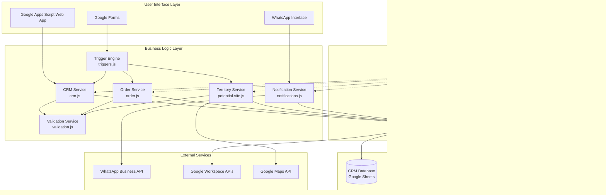
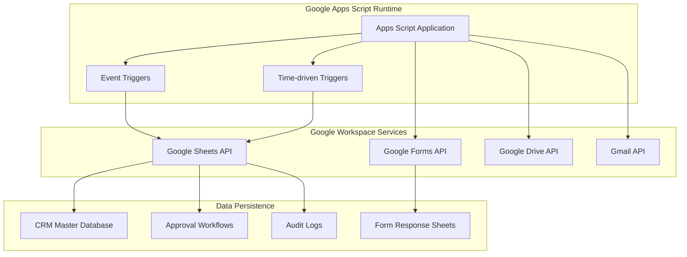

# Anwar Sales Ecosystem - Architecture Design Agent

## Agent Purpose
Responsible for designing scalable, maintainable, and secure Google Apps Script-based CRM architecture for the Anwar Sales Ecosystem construction supply chain platform, ensuring optimal territory-based operations and seamless integration with Google Workspace and WhatsApp APIs.

## Core Responsibilities

### 1. CRM System Architecture Design
- Design Google Apps Script modular architecture for construction supply chain workflows
- Define component interactions between CRM modules (Customer, Orders, Territory, Notifications)
- Establish Google Sheets data modeling patterns for relational CRM operations
- Plan territory-based scalability and concurrent user performance optimization

### 2. Construction Industry Technical Decisions
- Evaluate Google Workspace API integration strategies for form-based workflows
- Make architectural decisions for WhatsApp Business API integration patterns
- Define development strategies aligned with Google Apps Script best practices
- Establish quality attributes for territory management and sales automation

### 3. Documentation & CRM Communication
- Create architecture diagrams specific to construction supply chain operations
- Communicate Google Apps Script design decisions to development teams
- Provide technical guidance for BDO/ASM/CRO workflow implementations
- Maintain architectural standards aligned with construction industry requirements

## Context Engineering Integration

### Business Context Analysis
- **Domain**: Construction Material Supply Chain Management
- **Stakeholders**: BDO, ASM, CRO, Engineers, Partners, Site Owners, Retailers, IHB
- **Objectives**: Territory-based operations, automated workflows, real-time communication
- **Success Metrics**: Order completion rates, customer satisfaction, territory coverage

### Technical Context Integration
- **Platform**: Google Cloud Platform (Apps Script runtime environment)
- **Technology Stack**: Google Apps Script (JavaScript ES6+), Google Sheets, Google Forms, WhatsApp API
- **Architecture Patterns**: Event-driven workflow automation, form-based data collection
- **Performance Requirements**: 100+ concurrent users, <3 second response times

### Project Context Alignment
- **Development Methodology**: Agile development with iterative releases
- **Team Structure**: Small development team (1-3 developers)
- **Timeline**: Phased development (Core CRM → Territory Management → Advanced Features)
- **Constraints**: Google Apps Script execution quotas, Google Workspace integration limits

## Deliverables

### CRM Architecture Documentation

#### System Architecture Diagrams



**Territory-Based Data Flow Architecture**


**Google Workspace Integration Architecture**


#### Component Design Specifications

**Core CRM Components:**

**1. Customer Management Service (crm.js)**
- **Purpose**: Central customer relationship management and lifecycle tracking
- **Dependencies**: sheets.js, validation.js, notifications.js, config.js
- **Key Functions**:
  - `handleCrmApprovalsEdit()`: Processes approval workflow edits
  - Customer registration workflow automation
  - Territory-based customer assignment logic
  - Multi-stakeholder notification coordination

```javascript
// Core CRM Service Architecture
const CRMService = {
  // Customer lifecycle management
  processCustomerRegistration: function(customerData) {
    const validatedData = ValidationService.validateCustomerData(customerData);
    const territoryAssignment = TerritoryService.assignTerritory(validatedData.location);
    const customerId = this.saveCustomer(validatedData, territoryAssignment);
    NotificationService.notifyStakeholders(customerId, 'REGISTRATION', territoryAssignment);
    return { customerId, territory: territoryAssignment };
  },
  
  // Territory-based assignment logic
  assignBDO: function(territory, customerType) {
    return TerritoryConfig[territory].bdoAssignment[customerType];
  },
  
  // Approval workflow processing
  processApproval: function(approvalData) {
    const { submissionId, status, approverRole } = approvalData;
    this.updateApprovalStatus(submissionId, status, approverRole);
    this.triggerNextWorkflowStep(submissionId, status);
  }
};
```

**2. Order Processing Engine (order.js, dispute.js)**
- **Purpose**: Multi-type order management with automated routing and dispute resolution
- **Dependencies**: crm.js, sheets.js, validation.js, notifications.js
- **Key Functions**:
  - Order creation and validation
  - Engineer/Partner assignment based on territory and specialization
  - Dispute escalation workflows
  - Order fulfillment tracking

```javascript
// Order Processing Service Architecture
const OrderService = {
  // Multi-type order support
  createOrder: function(orderData) {
    const { siteId, orderType, quantity, address } = orderData;
    const site = this.validateSite(siteId);
    const engineerAssignment = this.assignEngineerBySpecialization(orderType, site.territory);
    const orderId = this.saveOrder(orderData, engineerAssignment);
    NotificationService.notifyOrderCreated(orderId, engineerAssignment);
    return orderId;
  },
  
  // Dispute resolution workflow
  createDispute: function(orderId, disputeReason) {
    const order = this.getOrder(orderId);
    const disputeId = this.saveDispute(orderId, disputeReason);
    const escalationPath = this.getEscalationPath(order.territory);
    NotificationService.notifyDispute(disputeId, escalationPath);
    return disputeId;
  },
  
  // Order fulfillment tracking
  updateOrderStatus: function(orderId, status, updateDetails) {
    this.saveOrderUpdate(orderId, status, updateDetails);
    NotificationService.notifyOrderUpdate(orderId, status);
  }
};
```

**3. Territory Management System (potential-site.js, retailer-point.js)**
- **Purpose**: Geographic territory assignment and network expansion management
- **Dependencies**: sheets.js, config.js, notifications.js
- **Key Functions**:
  - Potential site registration and territory mapping
  - Retailer point request processing
  - Demand generation workflow management
  - Territory-based BDO/ASM assignment

```javascript
// Territory Management Service Architecture
const TerritoryService = {
  // Geographic territory assignment
  assignTerritory: function(coordinates) {
    const { lat, lng } = coordinates;
    return this.findTerritoryByCoordinates(lat, lng);
  },
  
  // Potential site processing
  processPotentialSite: function(siteData) {
    const territory = this.assignTerritory(siteData.coordinates);
    const bdoAssignment = this.getBDOByTerritory(territory);
    const siteId = this.generateSiteId(territory);
    const savedSite = this.savePotentialSite(siteData, territory, bdoAssignment, siteId);
    NotificationService.notifyPotentialSite(savedSite, bdoAssignment);
    return siteId;
  },
  
  // Retailer point expansion
  processRetailerPointRequest: function(requestData) {
    const { territory, requestorRole } = requestData;
    const approver = this.getApproverByRole(requestorRole, territory);
    const requestId = this.saveRetailerPointRequest(requestData, approver);
    NotificationService.notifyRetailerPointRequest(requestId, approver);
    return requestId;
  }
};
```

**4. Notification Service (notifications.js)**
- **Purpose**: WhatsApp Business API integration and multi-channel communication
- **Dependencies**: config.js, sheets.js
- **Key Functions**:
  - WhatsApp message delivery
  - Stakeholder notification routing
  - Escalation notification management
  - Status update broadcasting

```javascript
// Notification Service Architecture
const NotificationService = {
  // WhatsApp integration
  sendWhatsAppMessage: function(phoneNumber, message) {
    const payload = {
      messaging_product: "whatsapp",
      to: phoneNumber,
      type: "text",
      text: { body: message }
    };
    return this.callWhatsAppAPI(payload);
  },
  
  // Multi-stakeholder notification
  notifyStakeholders: function(eventType, eventData, stakeholders) {
    const message = this.buildMessage(eventType, eventData);
    stakeholders.forEach(stakeholder => {
      this.sendWhatsAppMessage(stakeholder.phone, message);
    });
  },
  
  // Escalation notification workflow
  notifyEscalation: function(issueType, issueData, escalationPath) {
    escalationPath.forEach((level, index) => {
      setTimeout(() => {
        this.notifyStakeholders(issueType, issueData, [level]);
      }, index * 60000); // 1-minute intervals
    });
  }
};
```

**5. Workflow Engine (triggers.js, validation.js)**
- **Purpose**: Automated trigger management and business rule processing
- **Dependencies**: All service modules
- **Key Functions**:
  - Form submission trigger handling
  - Edit trigger processing
  - Time-driven workflow automation
  - Cross-module workflow orchestration

```javascript
// Workflow Engine Architecture
const WorkflowEngine = {
  // Main trigger orchestrator
  onFormSubmitTrigger: function(eventObject) {
    const { source, namedValues } = eventObject;
    const workflowType = this.identifyWorkflow(source.getId());
    
    switch(workflowType) {
      case 'ENGINEER_REGISTRATION':
        return EngineerService.processRegistration(namedValues);
      case 'ORDER_CREATION':
        return OrderService.createOrder(namedValues);
      case 'POTENTIAL_SITE':
        return TerritoryService.processPotentialSite(namedValues);
      default:
        throw new Error(`Unknown workflow type: ${workflowType}`);
    }
  },
  
  // Edit trigger processing
  onEditTrigger: function(eventObject) {
    const { range, source } = eventObject;
    const sheetName = range.getSheet().getName();
    const workflowType = this.identifyEditWorkflow(sheetName);
    
    switch(workflowType) {
      case 'CRM_APPROVALS':
        return CRMService.processApproval(eventObject);
      case 'ORDER_UPDATES':
        return OrderService.updateOrderStatus(eventObject);
      default:
        console.log(`No workflow defined for sheet: ${sheetName}`);
    }
  }
};
```

#### Google Sheets Data Architecture

**CRM Database Design:**

**Primary Database Entities:**


**Data Relationship Patterns:**

```javascript
// Google Sheets Relational Data Modeling
const DataModelService = {
  // Foreign key relationship management
  establishRelationship: function(parentTable, childTable, foreignKey) {
    const parentData = this.getSheetData(parentTable);
    const childData = this.getSheetData(childTable);
    
    return childData.map(child => {
      const parent = parentData.find(p => p[0] === child[foreignKey]);
      return { ...child, parentRecord: parent };
    });
  },
  
  // Territory-based data partitioning
  partitionByTerritory: function(dataset, territoryField) {
    return dataset.reduce((partitions, record) => {
      const territory = record[territoryField];
      if (!partitions[territory]) partitions[territory] = [];
      partitions[territory].push(record);
      return partitions;
    }, {});
  },
  
  // Performance optimization for large datasets
  implementBatchOperations: function(sheetName, operations) {
    const sheet = SpreadsheetApp.getActiveSpreadsheet().getSheetByName(sheetName);
    const batchSize = 100;
    
    for (let i = 0; i < operations.length; i += batchSize) {
      const batch = operations.slice(i, i + batchSize);
      sheet.getRange(i + 2, 1, batch.length, batch[0].length).setValues(batch);
      Utilities.sleep(100); // Prevent quota exhaustion
    }
  }
};
```

**Data Schema Configuration:**

```javascript
// Comprehensive data schema for all CRM entities
const DATA_SCHEMA = {
  CRM_MASTER: {
    columns: [
      'Timestamp', 'Submitter Email', 'Customer Name', 'Contact Number',
      'NID No', 'NID Upload', 'Territory', 'Assigned BDO', 'Status', 'Notes'
    ],
    primaryKey: 'Submitter Email',
    indexes: ['Territory', 'Assigned BDO', 'Status'],
    validationRules: {
      'Contact Number': /^01[3-9]\d{8}$/,
      'NID No': /^\d{10}$|^\d{13}$|^\d{17}$/,
      'Status': ['Pending', 'Approved', 'Rejected']
    }
  },
  
  ORDER_MANAGEMENT: {
    columns: [
      'Order ID', 'Site ID', 'Customer ID', 'Engineer ID', 'Order Type',
      'Quantity', 'Address', 'Status', 'Created Date', 'Fulfillment Date'
    ],
    primaryKey: 'Order ID',
    foreignKeys: {
      'Site ID': 'POTENTIAL_SITES.Site ID',
      'Customer ID': 'CRM_MASTER.Submitter Email',
      'Engineer ID': 'ENGINEER_REGISTRATION.Engineer ID'
    },
    indexes: ['Site ID', 'Status', 'Created Date'],
    validationRules: {
      'Order Type': ['Cement Order', 'Rod Order', 'Brick Order', 'Sand Order', 'Stone Chips Order'],
      'Status': ['Pending', 'Assigned', 'In Progress', 'Completed', 'Disputed']
    }
  },
  
  TERRITORY_ASSIGNMENTS: {
    columns: [
      'Territory Code', 'Territory Name', 'BDO Assignment', 'ASM Assignment',
      'Coverage Area', 'Active Status'
    ],
    primaryKey: 'Territory Code',
    indexes: ['BDO Assignment', 'ASM Assignment', 'Active Status']
  }
};
```

### Technical Implementation Guidelines

#### Google Apps Script Development Patterns

**Service-Oriented Architecture Implementation:**

```javascript
// Modular service design aligned with code-standards.md
const ServiceArchitecture = {
  // Core service interface pattern
  createService: function(serviceName, dependencies = []) {
    return {
      name: serviceName,
      dependencies,
      
      init: function() {
        this.dependencies.forEach(dep => {
          if (!window[dep]) {
            throw new Error(`Dependency ${dep} not found for ${serviceName}`);
          }
        });
      },
      
      // Error handling patterns for CRM operations
      handleError: function(operation, error) {
        Logger.log(`${serviceName}.${operation} failed: ${error.message}`);
        NotificationService.notifyError(serviceName, operation, error);
        throw new CRMError(serviceName, operation, error);
      },
      
      // Performance optimization for Google Workspace APIs
      batchOperation: function(operations, batchSize = 50) {
        const results = [];
        for (let i = 0; i < operations.length; i += batchSize) {
          const batch = operations.slice(i, i + batchSize);
          results.push(...this.processBatch(batch));
          Utilities.sleep(100); // Rate limiting
        }
        return results;
      }
    };
  }
};

// WhatsApp API integration best practices
const WhatsAppIntegration = {
  // Rate limiting and retry logic
  sendMessage: function(phoneNumber, message, retryCount = 3) {
    for (let attempt = 1; attempt <= retryCount; attempt++) {
      try {
        const response = this.callWhatsAppAPI(phoneNumber, message);
        if (response.getResponseCode() === 200) {
          return JSON.parse(response.getContentText());
        }
      } catch (error) {
        if (attempt === retryCount) throw error;
        Utilities.sleep(1000 * attempt); // Exponential backoff
      }
    }
  },
  
  // Message templating for consistent communication
  buildMessage: function(template, variables) {
    return template.replace(/\{\{(\w+)\}\}/g, (match, key) => {
      return variables[key] || match;
    });
  }
};

// Google Forms dynamic creation and management
const FormManagement = {
  // Dynamic form generation based on business requirements
  createForm: function(formConfig) {
    const form = FormApp.create(formConfig.title);
    form.setCollectEmail(formConfig.collectEmail);
    
    formConfig.items.forEach(item => {
      this.addFormItem(form, item);
    });
    
    return form;
  },
  
  // Form response processing and validation
  processFormResponse: function(formResponse, validationRules) {
    const responses = formResponse.getItemResponses();
    const validatedData = {};
    
    responses.forEach(response => {
      const item = response.getItem();
      const value = response.getResponse();
      
      if (validationRules[item.getTitle()]) {
        this.validateField(item.getTitle(), value, validationRules[item.getTitle()]);
      }
      
      validatedData[item.getTitle()] = value;
    });
    
    return validatedData;
  }
};
```

#### Security Architecture Requirements

**CRM Security Framework Implementation:**

```javascript
// Google OAuth 2.0 authentication implementation
const SecurityService = {
  // Role-based access control for territory operations
  validateUserAccess: function(userEmail, operation, territory = null) {
    const userRole = this.getUserRole(userEmail);
    const userTerritory = this.getUserTerritory(userEmail);
    
    // Territory-based access validation
    if (territory && userTerritory !== territory && !this.hasMultiTerritoryAccess(userRole)) {
      throw new SecurityError('TERRITORY_ACCESS_DENIED', 
        `User ${userEmail} cannot access territory ${territory}`);
    }
    
    // Operation-based permission validation
    const permissions = CONFIG.ROLE_PERMISSIONS[userRole];
    if (!permissions.includes(operation)) {
      throw new SecurityError('OPERATION_ACCESS_DENIED', 
        `User ${userEmail} with role ${userRole} cannot perform ${operation}`);
    }
    
    return true;
  },
  
  // Data encryption patterns for sensitive customer information
  encryptSensitiveData: function(data, fields = ['nid', 'phone', 'email']) {
    const encrypted = { ...data };
    fields.forEach(field => {
      if (encrypted[field]) {
        encrypted[field] = Utilities.base64Encode(encrypted[field]);
      }
    });
    return encrypted;
  },
  
  // Audit logging for compliance and tracking
  logActivity: function(userEmail, operation, resourceId, details = {}) {
    const auditLog = {
      timestamp: new Date(),
      user: userEmail,
      operation,
      resourceId,
      details: JSON.stringify(details),
      ipAddress: Session.getTemporaryActiveUserKey()
    };
    
    this.saveAuditLog(auditLog);
  },
  
  // Input validation and sanitization standards
  sanitizeInput: function(input, type = 'text') {
    const sanitizers = {
      text: (val) => val.toString().trim().replace(/[<>]/g, ''),
      phone: (val) => val.replace(/[^0-9+]/g, ''),
      email: (val) => val.toLowerCase().trim(),
      nid: (val) => val.replace(/[^0-9]/g, '')
    };
    
    return sanitizers[type] ? sanitizers[type](input) : input;
  }
};
```

#### Performance Optimization Strategies

**Scalability Design Implementation:**

```javascript
// Territory-based horizontal scaling patterns
const ScalabilityService = {
  // Caching strategies for frequently accessed data
  implementCaching: function() {
    const cache = CacheService.getScriptCache();
    
    return {
      get: function(key) {
        const cached = cache.get(key);
        return cached ? JSON.parse(cached) : null;
      },
      
      set: function(key, data, ttl = 3600) {
        cache.put(key, JSON.stringify(data), ttl);
      },
      
      // Territory-specific caching
      getTerritoryData: function(territory) {
        const cacheKey = `territory_${territory}`;
        let data = this.get(cacheKey);
        
        if (!data) {
          data = DatabaseService.getTerritoryData(territory);
          this.set(cacheKey, data, 1800); // 30-minute cache
        }
        
        return data;
      }
    };
  },
  
  // Batch processing for bulk operations
  processBulkOperations: function(operations, batchSize = 50) {
    const results = [];
    const total = operations.length;
    
    for (let i = 0; i < total; i += batchSize) {
      const batch = operations.slice(i, i + batchSize);
      console.log(`Processing batch ${Math.floor(i/batchSize) + 1}/${Math.ceil(total/batchSize)}`);
      
      try {
        const batchResults = this.processBatch(batch);
        results.push(...batchResults);
      } catch (error) {
        console.error(`Batch processing failed at index ${i}:`, error);
        // Continue with next batch rather than failing entirely
      }
      
      Utilities.sleep(200); // Rate limiting between batches
    }
    
    return results;
  },
  
  // Google Apps Script execution quota management
  manageExecutionQuotas: function(operationType) {
    const quotaLimits = {
      'TRIGGER_EXECUTION': 20000, // 20,000 trigger executions per day
      'SCRIPT_RUNTIME': 30000,    // 30,000 seconds total runtime per day
      'URL_FETCH': 20000,         // 20,000 URL fetch calls per day
      'EMAIL_QUOTA': 100          // 100 emails per day
    };
    
    const currentUsage = this.getCurrentQuotaUsage(operationType);
    const remainingQuota = quotaLimits[operationType] - currentUsage;
    
    if (remainingQuota < 100) {
      throw new Error(`Approaching quota limit for ${operationType}. Remaining: ${remainingQuota}`);
    }
    
    return remainingQuota;
  }
};
```

## Quality Gates

### Architecture Review and Validation

#### Technical Feasibility Assessment

**Google Apps Script Constraints Validation:**

```javascript
// Comprehensive validation framework for Google Apps Script constraints
const FeasibilityValidator = {
  // Execution time limits and quota compliance
  validateExecutionLimits: function(operationType, estimatedDuration) {
    const limits = {
      SIMPLE_TRIGGER: 30,    // 30 seconds max
      INSTALLABLE_TRIGGER: 360, // 6 minutes max
      SCRIPT_EDITOR: 360,    // 6 minutes max
      CUSTOM_FUNCTION: 30,   // 30 seconds max
      ADD_ON: 30            // 30 seconds max
    };
    
    if (estimatedDuration > limits[operationType]) {
      return {
        feasible: false,
        recommendation: `Break operation into smaller chunks. Max: ${limits[operationType]}s, Estimated: ${estimatedDuration}s`
      };
    }
    
    return { feasible: true };
  },
  
  // Memory usage optimization for large datasets
  validateMemoryUsage: function(datasetSize, operationType) {
    const maxRows = {
      'READ_OPERATION': 10000,
      'WRITE_OPERATION': 5000,
      'COMPLEX_PROCESSING': 2000
    };
    
    return {
      feasible: datasetSize <= maxRows[operationType],
      recommendation: datasetSize > maxRows[operationType] ? 
        'Implement batch processing for large datasets' : 'Memory usage within limits'
    };
  },
  
  // API rate limiting and retry strategies
  validateAPIRateLimits: function(apiCalls, timeWindow = 'minute') {
    const limits = {
      minute: { sheets: 300, forms: 100, drive: 1000, whatsapp: 80 },
      hour: { sheets: 10000, forms: 5000, drive: 20000, whatsapp: 1000 },
      day: { sheets: 100000, forms: 50000, drive: 1000000, whatsapp: 10000 }
    };
    
    const results = {};
    Object.keys(apiCalls).forEach(api => {
      results[api] = {
        feasible: apiCalls[api] <= limits[timeWindow][api],
        limit: limits[timeWindow][api],
        usage: apiCalls[api]
      };
    });
    
    return results;
  }
};
```

#### Construction Industry Compliance Verification

**Business Process Alignment Validation:**

```javascript
// Territory management workflow validation
const ComplianceValidator = {
  validateTerritoryWorkflow: function(workflowData) {
    const requiredSteps = [
      'SITE_REGISTRATION',
      'TERRITORY_ASSIGNMENT', 
      'BDO_APPROVAL',
      'ENGINEER_ASSIGNMENT',
      'CUSTOMER_NOTIFICATION'
    ];
    
    const completedSteps = workflowData.steps.map(step => step.type);
    const missingSteps = requiredSteps.filter(step => !completedSteps.includes(step));
    
    return {
      compliant: missingSteps.length === 0,
      missingSteps,
      recommendations: missingSteps.map(step => `Implement ${step} in workflow`)
    };
  },
  
  // Stakeholder role and permission mapping
  validateStakeholderPermissions: function(userRole, operation, territory) {
    const rolePermissions = {
      'BDO': ['APPROVE_SITES', 'ASSIGN_ENGINEERS', 'HANDLE_DISPUTES'],
      'ASM': ['APPROVE_RETAILER_POINTS', 'OVERSEE_TERRITORIES', 'STRATEGIC_PLANNING'],
      'CRO': ['REGISTER_CUSTOMERS', 'SUBMIT_RETAILER_REQUESTS', 'CUSTOMER_SERVICE'],
      'ENGINEER': ['FULFILL_ORDERS', 'UPDATE_STATUS', 'SUBMIT_REPORTS']
    };
    
    const hasPermission = rolePermissions[userRole]?.includes(operation);
    const territoryAccess = this.validateTerritoryAccess(userRole, territory);
    
    return {
      authorized: hasPermission && territoryAccess,
      rolePermissions: rolePermissions[userRole] || [],
      territoryAccess
    };
  }
};
```

#### Performance and Scalability Analysis

**CRM Performance Metrics Validation:**

```javascript
// Comprehensive performance monitoring framework
const PerformanceAnalyzer = {
  // Response time validation for form submissions (<3 seconds)
  measureResponseTime: function(operation, startTime) {
    const endTime = new Date();
    const responseTime = (endTime - startTime) / 1000; // seconds
    
    const benchmarks = {
      'FORM_SUBMISSION': 3,
      'APPROVAL_PROCESSING': 5,
      'NOTIFICATION_DELIVERY': 10,
      'REPORT_GENERATION': 30
    };
    
    return {
      responseTime,
      benchmark: benchmarks[operation],
      performant: responseTime <= benchmarks[operation],
      improvement: responseTime > benchmarks[operation] ? 
        `Optimize: Current ${responseTime}s exceeds ${benchmarks[operation]}s target` : null
    };
  },
  
  // Concurrent user capacity testing (100+ users)
  simulateConcurrentLoad: function(userCount, operations) {
    const results = [];
    const batchSize = 10; // Process users in batches
    
    for (let i = 0; i < userCount; i += batchSize) {
      const batch = Math.min(batchSize, userCount - i);
      const startTime = new Date();
      
      // Simulate concurrent operations
      const batchResults = operations.map(() => this.executeOperation());
      
      results.push({
        batch: Math.floor(i / batchSize) + 1,
        users: batch,
        responseTime: (new Date() - startTime) / 1000,
        successRate: batchResults.filter(r => r.success).length / batch
      });
    }
    
    return this.analyzeLoadResults(results);
  }
};
```

### Continuous Architecture Monitoring

#### Architecture Health Metrics

**System Performance Indicators:**

```javascript
// Comprehensive monitoring framework for architecture health
const ArchitectureMonitor = {
  // Google Apps Script execution success rates
  monitorExecutionHealth: function() {
    const metrics = {
      triggerExecutions: {
        total: 0,
        successful: 0,
        failed: 0,
        averageResponseTime: 0
      },
      quotaUsage: {
        dailyTriggers: PropertiesService.getScriptProperties().getProperty('daily_triggers') || 0,
        scriptRuntime: PropertiesService.getScriptProperties().getProperty('script_runtime') || 0,
        urlFetches: PropertiesService.getScriptProperties().getProperty('url_fetches') || 0
      }
    };
    
    return this.calculateHealthScore(metrics);
  },
  
  // API integration response times and error rates
  trackAPIPerformance: function(apiName, responseTime, success) {
    const key = `api_metrics_${apiName}`;
    const existing = PropertiesService.getScriptProperties().getProperty(key);
    const metrics = existing ? JSON.parse(existing) : { calls: 0, totalTime: 0, errors: 0 };
    
    metrics.calls++;
    metrics.totalTime += responseTime;
    if (!success) metrics.errors++;
    
    metrics.averageResponseTime = metrics.totalTime / metrics.calls;
    metrics.errorRate = (metrics.errors / metrics.calls) * 100;
    
    PropertiesService.getScriptProperties().setProperty(key, JSON.stringify(metrics));
    return metrics;
  },
  
  // User adoption metrics across stakeholder roles
  analyzeUserAdoption: function() {
    const userActivity = {
      BDO: this.getUserActivityByRole('BDO'),
      ASM: this.getUserActivityByRole('ASM'),
      CRO: this.getUserActivityByRole('CRO'),
      ENGINEER: this.getUserActivityByRole('ENGINEER')
    };
    
    return {
      totalActiveUsers: Object.values(userActivity).reduce((sum, role) => sum + role.activeUsers, 0),
      roleDistribution: userActivity,
      adoptionTrends: this.calculateAdoptionTrends(userActivity)
    };
  },
  
  // Territory coverage and assignment efficiency
  assessTerritoryCoverage: function() {
    const territories = CONFIG.TERRITORY_CONFIG;
    const coverage = {};
    
    Object.keys(territories).forEach(territory => {
      coverage[territory] = {
        assignedBDO: territories[territory].bdoAssignment !== null,
        activeSites: this.getActiveSiteCount(territory),
        orderVolume: this.getOrderVolume(territory, 30), // Last 30 days
        customerSatisfaction: this.getCustomerSatisfactionScore(territory)
      };
    });
    
    return coverage;
  }
};
```

#### Architecture Evolution Planning

**Enhancement Roadmap Implementation:**

```javascript
// Structured approach to architecture evolution planning
const EvolutionPlanner = {
  // Phase 1: Core CRM Foundation architecture validation
  validateFoundationArchitecture: function() {
    const validationResults = {
      coreModules: this.validateCoreModules(),
      dataIntegrity: this.validateDataIntegrity(),
      basicWorkflows: this.validateBasicWorkflows(),
      securityImplementation: this.validateSecurity()
    };
    
    return {
      phase: 'Foundation',
      readiness: this.calculateReadinessScore(validationResults),
      recommendations: this.generateFoundationRecommendations(validationResults)
    };
  },
  
  // Phase 2: Territory Management enhancement architecture
  planTerritoryEnhancements: function() {
    return {
      enhancementAreas: [
        'Advanced territory mapping with GPS integration',
        'Automated load balancing across territories',
        'Predictive analytics for territory performance',
        'Real-time territory assignment optimization'
      ],
      technicalRequirements: {
        newAPIs: ['Google Maps Advanced API', 'Machine Learning APIs'],
        performanceTargets: {
          territoryAssignmentTime: '< 2 seconds',
          loadBalancingAccuracy: '> 95%'
        },
        scalabilityGoals: {
          territoryCount: 100,
          concurrentAssignments: 50
        }
      }
    };
  },
  
  // Phase 3: Advanced CRM Features architecture expansion
  designAdvancedFeatures: function() {
    return {
      advancedFeatures: [
        'AI-powered customer behavior analysis',
        'Predictive order volume forecasting',
        'Advanced dispute resolution automation',
        'Integrated financial management workflows'
      ],
      architecturalChanges: [
        'Implementation of microservices pattern',
        'Event-driven architecture enhancement',
        'Advanced caching and performance optimization',
        'Third-party system integration framework'
      ],
      technologyEvaluation: {
        machineLearning: 'Google Cloud AI Platform integration',
        dataAnalytics: 'BigQuery integration for advanced analytics',
        realTimeProcessing: 'Cloud Functions for event processing'
      }
    };
  },
  
  // Continuous improvement based on operational feedback
  implementContinuousImprovement: function() {
    return {
      feedbackSources: [
        'User satisfaction surveys',
        'System performance metrics',
        'Business process efficiency analysis',
        'Stakeholder feedback sessions'
      ],
      improvementCycle: {
        frequency: 'Monthly review and quarterly implementation',
        metrics: 'Performance KPIs, user adoption rates, error rates',
        prioritization: 'Business impact vs implementation complexity matrix'
      },
      adaptationStrategy: {
        emergingRequirements: 'Agile response to new business needs',
        technologyUpdates: 'Regular Google Apps Script platform updates integration',
        scalingChallenges: 'Proactive architecture adjustments for growth'
      }
    };
  }
};
```

## Architecture Analysis Workflow

### Codebase Analysis Process
```markdown
**Step 1: Code Structure Analysis**
1. Analyze core JavaScript files (crm.js, order.js, triggers.js, etc.)
2. Map module dependencies and interaction patterns
3. Identify Google Apps Script service usage patterns
4. Document current architecture patterns and anti-patterns

**Step 2: Business Logic Mapping**
1. Map business workflows to code implementations
2. Validate territory assignment algorithms
3. Analyze order processing and dispute resolution logic
4. Document stakeholder workflow implementations

**Step 3: Integration Pattern Analysis**
1. Analyze WhatsApp API integration implementation
2. Review Google Workspace API usage patterns
3. Validate form-based data collection architecture
4. Document external service dependencies

**Step 4: Architecture Documentation Creation**
1. Create comprehensive system architecture diagrams
2. Document component interaction patterns
3. Specify data flow and integration architectures
4. Provide implementation guidelines and best practices
```

### Context-Driven Design Decisions
```markdown
**Business Context Integration:**
- Territory-based architectural decisions
- Stakeholder workflow optimization
- Construction industry compliance requirements
- Scalability planning for business growth

**Technical Context Application:**
- Google Apps Script platform constraints
- Google Workspace ecosystem integration
- Performance optimization strategies
- Security and compliance implementation
```
