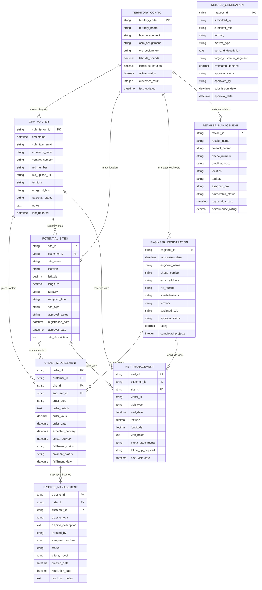

# Anwar Sales Ecosystem - Data Architecture Documentation

**Version:** 1.0  
**Date:** August 3, 2025  
**Document Owner:** Architecture Design Agent  
**Status:** Active Documentation

---

## 📋 Table of Contents

1. [Data Architecture Overview](#data-architecture-overview)
2. [Google Sheets Database Design](#google-sheets-database-design)
3. [Data Relationship Patterns](#data-relationship-patterns)
4. [Data Schema Configuration](#data-schema-configuration)
5. [Data Access Patterns](#data-access-patterns)
6. [Performance Optimization](#performance-optimization)

---

## 🎯 Data Architecture Overview

The **Anwar Sales Ecosystem** implements a sophisticated **Google Sheets-based relational data architecture** that leverages Google Workspace's native capabilities while maintaining the structure and integrity of traditional relational databases.

### Database Design Principles

#### 1. **Relational Data Modeling in Google Sheets**

- **Entity Relationship Management**: Structured foreign key relationships between sheets
- **Data Normalization**: Reduced redundancy through proper table structure
- **Referential Integrity**: Enforced through validation and lookup functions
- **ACID Compliance**: Achieved through Google Sheets' transaction handling

#### 2. **Territory-Based Data Partitioning**

- **Geographic Isolation**: Territory-specific data organization for optimal performance
- **Hierarchical Access Control**: Role-based data access aligned with organizational structure
- **Scalable Data Distribution**: Automatic load balancing across territories
- **Cross-Territory Analytics**: Aggregated reporting while maintaining data isolation

#### 3. **Event Sourcing Pattern**

- **Complete Audit Trail**: Every data change captured with timestamp and user context
- **State Reconstruction**: Ability to rebuild any entity state from event history
- **Workflow Tracking**: Complete visibility into business process progression
- **Compliance Support**: Comprehensive documentation for regulatory requirements

---

## 🗄️ Google Sheets Database Design

### Primary Database Entities



---

## 🔗 Data Relationship Patterns

### Foreign Key Relationship Management

```javascript
// Google Sheets Relational Data Modeling Service
const DataModelService = {
  
  // Establish and maintain foreign key relationships
  establishRelationship: function(parentTable, childTable, foreignKey) {
    const parentData = this.getSheetData(parentTable);
    const childData = this.getSheetData(childTable);
    
    return childData.map(child => {
      const parent = parentData.find(p => p[0] === child[foreignKey]);
      return { ...child, parentRecord: parent };
    });
  },
  
  // Territory-based data partitioning for optimal performance
  partitionByTerritory: function(dataset, territoryField) {
    return dataset.reduce((partitions, record) => {
      const territory = record[territoryField];
      if (!partitions[territory]) partitions[territory] = [];
      partitions[territory].push(record);
      return partitions;
    }, {});
  },
  
  // Cross-reference validation for data integrity
  validateForeignKeys: function(sheetName, record) {
    const schema = DATA_SCHEMA[sheetName];
    const validationResults = [];
    
    schema.foreignKeys?.forEach(fk => {
      const referencedRecord = this.findReferencedRecord(fk.referenceTable, fk.referenceKey, record[fk.column]);
      if (!referencedRecord) {
        validationResults.push({
          error: 'FOREIGN_KEY_VIOLATION',
          column: fk.column,
          value: record[fk.column],
          reference: fk.referenceTable
        });
      }
    });
    
    return validationResults;
  },
  
  // Cascade operations for relationship maintenance
  cascadeUpdate: function(parentTable, parentId, newValues) {
    const cascadeRules = this.getCascadeRules(parentTable);
    
    cascadeRules.forEach(rule => {
      const childRecords = this.getRelatedRecords(rule.childTable, rule.foreignKey, parentId);
      
      childRecords.forEach(childRecord => {
        if (rule.operation === 'UPDATE') {
          this.updateRelatedRecord(rule.childTable, childRecord.id, rule.updateFields, newValues);
        } else if (rule.operation === 'DELETE') {
          this.deleteRelatedRecord(rule.childTable, childRecord.id);
        }
      });
    });
  }
};
```

### Territory-Based Data Distribution

```javascript
// Territory-specific data access patterns
const TerritoryDataService = {
  
  // Retrieve territory-specific customer data
  getTerritoryCustomers: function(territoryCode) {
    const customers = this.getSheetData('CRM_MASTER');
    return customers.filter(customer => customer.territory === territoryCode);
  },
  
  // Aggregate territory performance metrics
  getTerritoryMetrics: function(territoryCode) {
    const customers = this.getTerritoryCustomers(territoryCode);
    const orders = this.getTerritoryOrders(territoryCode);
    const sites = this.getTerritorySites(territoryCode);
    
    return {
      totalCustomers: customers.length,
      totalOrders: orders.length,
      totalSites: sites.length,
      averageOrderValue: this.calculateAverageOrderValue(orders),
      customerSatisfaction: this.calculateSatisfactionScore(territoryCode),
      conversionRate: orders.length / sites.length
    };
  },
  
  // Cross-territory analytics with data aggregation
  generateCrossTerritoryReport: function() {
    const territories = this.getAllTerritories();
    
    return territories.map(territory => ({
      territory: territory.code,
      metrics: this.getTerritoryMetrics(territory.code),
      trends: this.calculateTerritoryTrends(territory.code),
      rankings: this.calculateTerritoryRankings(territory.code)
    }));
  }
};
```

---

## 📊 Data Schema Configuration

### Comprehensive Data Schema Definition

```javascript
// Complete data schema for all CRM entities
const DATA_SCHEMA = {
  CRM_MASTER: {
    sheetName: 'CRM Database',
    columns: [
      'Timestamp', 'Submitter Email', 'Customer Name', 'Contact Number',
      'NID No', 'NID Upload', 'Territory', 'Assigned BDO', 'Approval Status', 'Notes'
    ],
    primaryKey: 'Timestamp',
    foreignKeys: [
      { column: 'Territory', referenceTable: 'TERRITORY_CONFIG', referenceKey: 'territory_code' }
    ],
    indexes: ['Territory', 'Assigned BDO', 'Approval Status'],
    validationRules: {
      'Customer Name': { required: true, minLength: 2, maxLength: 100 },
      'Contact Number': { required: true, pattern: /^(\+8801|01)[3-9]\d{8}$/ },
      'NID No': { required: true, pattern: /^\d{10}$|^\d{13}$|^\d{17}$/ },
      'Territory': { required: true, allowedValues: ['DHAKA_NORTH', 'DHAKA_SOUTH', 'CHITTAGONG', 'SYLHET'] }
    }
  },
  
  ORDER_MANAGEMENT: {
    sheetName: 'Order Management',
    columns: [
      'Order ID', 'Customer ID', 'Site ID', 'Engineer ID', 'Order Type',
      'Order Details', 'Order Value', 'Order Date', 'Expected Delivery',
      'Actual Delivery', 'Fulfillment Status', 'Payment Status'
    ],
    primaryKey: 'Order ID',
    foreignKeys: [
      { column: 'Customer ID', referenceTable: 'CRM_MASTER', referenceKey: 'Timestamp' },
      { column: 'Site ID', referenceTable: 'POTENTIAL_SITES', referenceKey: 'Site ID' },
      { column: 'Engineer ID', referenceTable: 'ENGINEER_REGISTRATION', referenceKey: 'Engineer ID' }
    ],
    indexes: ['Customer ID', 'Engineer ID', 'Fulfillment Status', 'Order Date'],
    validationRules: {
      'Order Type': { required: true, allowedValues: ['CEMENT', 'ROD', 'BRICK', 'SAND', 'STONE'] },
      'Order Value': { required: true, type: 'number', min: 0 },
      'Order Date': { required: true, type: 'date' },
      'Fulfillment Status': { allowedValues: ['PENDING', 'IN_PROGRESS', 'COMPLETED', 'DELAYED', 'CANCELLED'] }
    }
  },
  
  ENGINEER_REGISTRATION: {
    sheetName: 'Engineer Registration & Updates',
    columns: [
      'Engineer ID', 'Registration Date', 'Engineer Name', 'Phone Number',
      'Email Address', 'NID Number', 'Specializations', 'Territory',
      'Assigned BDO', 'Approval Status', 'Rating', 'Completed Projects'
    ],
    primaryKey: 'Engineer ID',
    foreignKeys: [
      { column: 'Territory', referenceTable: 'TERRITORY_CONFIG', referenceKey: 'territory_code' }
    ],
    indexes: ['Territory', 'Assigned BDO', 'Approval Status', 'Specializations'],
    validationRules: {
      'Engineer Name': { required: true, minLength: 2, maxLength: 100 },
      'Phone Number': { required: true, pattern: /^(\+8801|01)[3-9]\d{8}$/ },
      'Email Address': { required: true, type: 'email' },
      'Specializations': { required: true, allowedValues: ['CEMENT', 'ROD', 'BRICK', 'SAND', 'STONE', 'GENERAL'] },
      'Rating': { type: 'number', min: 0, max: 5 }
    }
  },
  
  POTENTIAL_SITES: {
    sheetName: 'Potential Site Management',
    columns: [
      'Site ID', 'Customer ID', 'Site Name', 'Location', 'Latitude', 'Longitude',
      'Territory', 'Assigned BDO', 'Site Type', 'Approval Status',
      'Registration Date', 'Approval Date', 'Site Description'
    ],
    primaryKey: 'Site ID',
    foreignKeys: [
      { column: 'Customer ID', referenceTable: 'CRM_MASTER', referenceKey: 'Timestamp' },
      { column: 'Territory', referenceTable: 'TERRITORY_CONFIG', referenceKey: 'territory_code' }
    ],
    indexes: ['Customer ID', 'Territory', 'Assigned BDO', 'Approval Status'],
    validationRules: {
      'Site Name': { required: true, minLength: 2, maxLength: 200 },
      'Location': { required: true, minLength: 5, maxLength: 500 },
      'Latitude': { type: 'number', min: -90, max: 90 },
      'Longitude': { type: 'number', min: -180, max: 180 },
      'Site Type': { allowedValues: ['RESIDENTIAL', 'COMMERCIAL', 'INDUSTRIAL', 'INFRASTRUCTURE'] }
    }
  },
  
  TERRITORY_ASSIGNMENTS: {
    sheetName: 'Territory Configuration',
    columns: [
      'Territory Code', 'Territory Name', 'BDO Assignment', 'ASM Assignment',
      'CRO Assignment', 'Latitude Bounds', 'Longitude Bounds', 'Active Status',
      'Customer Count', 'Last Updated'
    ],
    primaryKey: 'Territory Code',
    indexes: ['BDO Assignment', 'ASM Assignment', 'Active Status'],
    validationRules: {
      'Territory Code': { required: true, pattern: /^[A-Z_]+$/ },
      'Territory Name': { required: true, minLength: 2, maxLength: 100 },
      'Active Status': { required: true, allowedValues: ['ACTIVE', 'INACTIVE'] }
    }
  },
  
  DISPUTE_MANAGEMENT: {
    sheetName: 'Dispute Management',
    columns: [
      'Dispute ID', 'Order ID', 'Customer ID', 'Dispute Type', 'Dispute Description',
      'Initiated By', 'Assigned Resolver', 'Status', 'Priority Level',
      'Created Date', 'Resolution Date', 'Resolution Notes'
    ],
    primaryKey: 'Dispute ID',
    foreignKeys: [
      { column: 'Order ID', referenceTable: 'ORDER_MANAGEMENT', referenceKey: 'Order ID' },
      { column: 'Customer ID', referenceTable: 'CRM_MASTER', referenceKey: 'Timestamp' }
    ],
    indexes: ['Order ID', 'Customer ID', 'Status', 'Priority Level', 'Created Date'],
    validationRules: {
      'Dispute Type': { required: true, allowedValues: ['QUALITY', 'DELIVERY', 'PAYMENT', 'SERVICE', 'OTHER'] },
      'Status': { required: true, allowedValues: ['OPEN', 'IN_PROGRESS', 'RESOLVED', 'ESCALATED', 'CLOSED'] },
      'Priority Level': { required: true, allowedValues: ['LOW', 'MEDIUM', 'HIGH', 'CRITICAL'] }
    }
  }
};
```

---

## 🚀 Data Access Patterns

### High-Performance Data Access Service

```javascript
// Optimized data access patterns for Google Sheets
const DataAccessService = {
  
  // Batch operations for improved performance
  implementBatchOperations: function(sheetName, operations) {
    const sheet = SpreadsheetApp.getActiveSpreadsheet().getSheetByName(sheetName);
    const batchSize = 100;
    
    for (let i = 0; i < operations.length; i += batchSize) {
      const batch = operations.slice(i, i + batchSize);
      const values = batch.map(op => op.values);
      
      if (batch[0].operation === 'INSERT') {
        sheet.getRange(sheet.getLastRow() + 1, 1, batch.length, values[0].length).setValues(values);
      } else if (batch[0].operation === 'UPDATE') {
        batch.forEach(op => {
          sheet.getRange(op.row, 1, 1, op.values.length).setValues([op.values]);
        });
      }
      
      Utilities.sleep(100); // Prevent quota exhaustion
    }
  },
  
  // Caching strategy for frequently accessed data
  implementDataCaching: function() {
    const cache = CacheService.getScriptCache();
    
    return {
      get: function(key) {
        const cached = cache.get(key);
        return cached ? JSON.parse(cached) : null;
      },
      
      set: function(key, data, ttl = 3600) {
        cache.put(key, JSON.stringify(data), ttl);
      },
      
      getOrSet: function(key, dataProvider, ttl = 3600) {
        let data = this.get(key);
        if (!data) {
          data = dataProvider();
          this.set(key, data, ttl);
        }
        return data;
      }
    };
  },
  
  // Optimized query patterns
  executeOptimizedQuery: function(sheetName, filters, sortBy, limit) {
    const cache = this.implementDataCaching();
    const cacheKey = `query_${sheetName}_${JSON.stringify(filters)}_${sortBy}_${limit}`;
    
    return cache.getOrSet(cacheKey, () => {
      const sheet = SpreadsheetApp.getActiveSpreadsheet().getSheetByName(sheetName);
      const data = sheet.getDataRange().getValues();
      const headers = data[0];
      const records = data.slice(1);
      
      let filteredRecords = records;
      
      // Apply filters
      if (filters) {
        filteredRecords = records.filter(record => {
          return Object.keys(filters).every(filterKey => {
            const columnIndex = headers.indexOf(filterKey);
            return columnIndex !== -1 && record[columnIndex] === filters[filterKey];
          });
        });
      }
      
      // Apply sorting
      if (sortBy) {
        const sortColumnIndex = headers.indexOf(sortBy);
        if (sortColumnIndex !== -1) {
          filteredRecords.sort((a, b) => {
            return a[sortColumnIndex] > b[sortColumnIndex] ? 1 : -1;
          });
        }
      }
      
      // Apply limit
      if (limit) {
        filteredRecords = filteredRecords.slice(0, limit);
      }
      
      return filteredRecords.map(record => {
        const obj = {};
        headers.forEach((header, index) => {
          obj[header] = record[index];
        });
        return obj;
      });
    }, 1800); // 30-minute cache
  }
};
```

---

## ⚡ Performance Optimization

### Database Performance Strategies

```javascript
// Performance monitoring and optimization service
const PerformanceOptimizationService = {
  
  // Query performance monitoring
  monitorQueryPerformance: function(queryFunction, queryName) {
    const startTime = Date.now();
    
    try {
      const result = queryFunction();
      const executionTime = Date.now() - startTime;
      
      this.logPerformanceMetric(queryName, executionTime, 'SUCCESS', result.length);
      
      if (executionTime > 5000) { // Log slow queries
        this.logSlowQuery(queryName, executionTime);
      }
      
      return result;
    } catch (error) {
      const executionTime = Date.now() - startTime;
      this.logPerformanceMetric(queryName, executionTime, 'ERROR', 0);
      throw error;
    }
  },
  
  // Data pagination for large datasets
  implementPagination: function(sheetName, pageSize = 50, pageNumber = 1) {
    const startRow = (pageNumber - 1) * pageSize + 2; // +2 for header row
    const sheet = SpreadsheetApp.getActiveSpreadsheet().getSheetByName(sheetName);
    
    const totalRows = sheet.getLastRow();
    const totalPages = Math.ceil((totalRows - 1) / pageSize);
    
    if (startRow > totalRows) {
      return { data: [], pagination: { currentPage: pageNumber, totalPages, totalRows: totalRows - 1 } };
    }
    
    const endRow = Math.min(startRow + pageSize - 1, totalRows);
    const data = sheet.getRange(startRow, 1, endRow - startRow + 1, sheet.getLastColumn()).getValues();
    
    return {
      data: data,
      pagination: {
        currentPage: pageNumber,
        totalPages: totalPages,
        totalRows: totalRows - 1,
        pageSize: pageSize
      }
    };
  },
  
  // Index management for faster lookups
  createVirtualIndexes: function() {
    const cache = CacheService.getScriptCache();
    
    // Create indexes for frequently queried fields
    const indexConfigs = [
      { sheet: 'CRM_MASTER', field: 'Territory', cacheKey: 'idx_crm_territory' },
      { sheet: 'ORDER_MANAGEMENT', field: 'Customer ID', cacheKey: 'idx_order_customer' },
      { sheet: 'ENGINEER_REGISTRATION', field: 'Territory', cacheKey: 'idx_engineer_territory' }
    ];
    
    indexConfigs.forEach(config => {
      const sheet = SpreadsheetApp.getActiveSpreadsheet().getSheetByName(config.sheet);
      const data = sheet.getDataRange().getValues();
      const headers = data[0];
      const fieldIndex = headers.indexOf(config.field);
      
      if (fieldIndex !== -1) {
        const index = {};
        for (let i = 1; i < data.length; i++) {
          const fieldValue = data[i][fieldIndex];
          if (!index[fieldValue]) index[fieldValue] = [];
          index[fieldValue].push(i + 1); // Store row numbers
        }
        
        cache.put(config.cacheKey, JSON.stringify(index), 7200); // 2-hour cache
      }
    });
  }
};
```

This comprehensive data architecture documentation provides the foundation for understanding how the Anwar Sales Ecosystem leverages Google Sheets as a sophisticated relational database while maintaining optimal performance and data integrity across all construction supply chain management operations.
