# Anwar Sales Ecosystem - System Architecture Overview

**Version:** 1.0  
**Date:** August 3, 2025  
**Document Owner:** Architecture Design Agent  
**Status:** Active Documentation

---

## 📋 Table of Contents
1. [Executive Summary](#executive-summary)
2. [System Architecture Diagrams](#system-architecture-diagrams)
3. [Component Design Specifications](#component-design-specifications)
4. [Data Architecture](#data-architecture)
5. [Integration Architecture](#integration-architecture)
6. [Security Architecture](#security-architecture)
7. [Performance Architecture](#performance-architecture)
8. [Deployment Architecture](#deployment-architecture)

---

## 🎯 Executive Summary

The **Anwar Sales Ecosystem** implements a sophisticated Google Apps Script-based architecture designed for construction supply chain management. The system follows a **modular service-oriented architecture (SOA)** pattern, leveraging Google Workspace APIs for data persistence and WhatsApp Business API for real-time stakeholder communication.

### Architectural Principles

#### 1. **Zero-Infrastructure CRM Architecture**
- **Platform**: Google Cloud Platform (Apps Script runtime environment)
- **Deployment**: Serverless execution model with automatic scaling
- **Cost Model**: Pay-per-execution with Google Workspace licensing
- **Maintenance**: Minimal infrastructure management overhead

#### 2. **Territory-Based Modular Design**
- **Geographic Partitioning**: Territory-specific data isolation and processing
- **Role-Based Service Routing**: Automated workflow routing based on organizational hierarchy
- **Scalable Assignment Logic**: Dynamic resource allocation across territories
- **Multi-Stakeholder Coordination**: Seamless integration across BDO, ASM, CRO workflows

#### 3. **Event-Driven Workflow Automation**
- **Form-Based Data Collection**: Google Forms integration for structured data input
- **Trigger-Based Processing**: Real-time and scheduled workflow execution
- **Notification-Driven Communication**: WhatsApp integration for instant stakeholder updates
- **State Management**: Comprehensive audit trails and workflow state tracking

### Core Architectural Components


---

## 🏗️ System Architecture Diagrams

### Territory-Based Data Flow Architecture

The system implements sophisticated territory-based routing to ensure optimal resource allocation and stakeholder coordination:

```mermaid
graph LR
    subgraph "🗺️ Territory Assignment Flow"
        PS[Potential Site<br/>Registration] --> TA[Territory<br/>Analysis]
        TA --> BDO[BDO<br/>Assignment]
        BDO --> ENG[Engineer<br/>Assignment]
        ENG --> ORD[Order<br/>Processing]
        ORD --> FUL[Fulfillment<br/>Tracking]
    end
    
    subgraph "📱 Stakeholder Notification Flow"
        BDO --> |WhatsApp| BDOWH[BDO<br/>Notification]
        ENG --> |WhatsApp| ENGWH[Engineer<br/>Notification]
        ORD --> |WhatsApp| CUSTWH[Customer<br/>Notification]
        FUL --> |WhatsApp| ALLWH[All Stakeholders<br/>Update]
    end
    
    subgraph "⚠️ Escalation Flow"
        DIS[Dispute<br/>Creation] --> CROE[CRO<br/>Escalation]
        CROE --> BDOE[BDO<br/>Escalation]
        BDOE --> ASME[ASM<br/>Escalation]
        ASME --> BDIE[BD Incharge<br/>Final Resolution]
    end
    
    %% Cross-flow connections
    ORD -.-> DIS
    FUL -.-> DIS
```



### Google Workspace Integration Architecture

The platform leverages the complete Google Workspace ecosystem for seamless data management and workflow automation:


### WhatsApp Integration Architecture

Real-time communication is achieved through sophisticated WhatsApp Business API integration:

```mermaid
graph TB
    subgraph "📱 WhatsApp Integration Layer"
        WH_SRV[WhatsApp Service<br/>notifications.js]
        MSG_QUE[Message Queue<br/>Batch Processing]
        TMPL[Message Templates<br/>Standardized Communication]
        RATE[Rate Limiter<br/>API Quota Management]
    end
    
    subgraph "👥 Stakeholder Groups"
        BDO_GRP[BDO Group<br/>Territory Managers]
        ASM_GRP[ASM Group<br/>Area Managers]
        CRO_GRP[CRO Group<br/>Customer Relations]
        ENG_GRP[Engineer Group<br/>Technical Service]
        CUST_GRP[Customer Group<br/>End Users]
    end
    
    subgraph "📩 Message Types"
        REG_MSG[Registration<br/>Confirmations]
        ORD_MSG[Order<br/>Updates]
        DIS_MSG[Dispute<br/>Notifications]
        APP_MSG[Approval<br/>Requests]
        ESC_MSG[Escalation<br/>Alerts]
    end
    
    %% Service Flow
    WH_SRV --> MSG_QUE
    MSG_QUE --> TMPL
    TMPL --> RATE
    
    %% Stakeholder Routing
    RATE --> BDO_GRP
    RATE --> ASM_GRP
    RATE --> CRO_GRP
    RATE --> ENG_GRP
    RATE --> CUST_GRP
    
    %% Message Type Distribution
    REG_MSG -.-> BDO_GRP
    ORD_MSG -.-> ENG_GRP
    ORD_MSG -.-> CUST_GRP
    DIS_MSG -.-> BDO_GRP
    DIS_MSG -.-> CRO_GRP
    APP_MSG -.-> ASM_GRP
    ESC_MSG -.-> ASM_GRP
```



---

## ⚙️ Component Design Specifications

### Core Business Logic Components

#### 1. **Customer Relationship Management Service (crm.js)**

**Purpose**: Central customer lifecycle management and territory-based operations coordination

**Architecture Pattern**: Service Layer with Event-Driven Processing

**Key Responsibilities**:
- Customer registration workflow automation
- Territory-based assignment logic implementation
- Multi-stakeholder approval process coordination
- Cross-module communication facilitation

**Component Interface**:
```javascript
// CRM Service Architecture
const CRMService = {
  // Customer lifecycle management
  processCustomerRegistration: function(customerData) {
    const validatedData = ValidationService.validateCustomerData(customerData);
    const territoryAssignment = TerritoryService.assignTerritory(validatedData.location);
    const customerId = this.saveCustomer(validatedData, territoryAssignment);
    NotificationService.notifyStakeholders(customerId, 'REGISTRATION', territoryAssignment);
    return { customerId, territory: territoryAssignment };
  },
  
  // Territory-based assignment logic
  assignBDO: function(territory, customerType) {
    const territoryConfig = ConfigService.getTerritoryConfiguration(territory);
    return territoryConfig.bdoAssignment[customerType];
  },
  
  // Approval workflow processing
  processApproval: function(approvalData) {
    const { submissionId, status, approverRole } = approvalData;
    this.updateApprovalStatus(submissionId, status, approverRole);
    this.triggerNextWorkflowStep(submissionId, status);
    NotificationService.notifyApprovalUpdate(submissionId, status, approverRole);
  },
  
  // Edit trigger handling for CRM approvals
  handleCrmApprovalsEdit: function(editEvent) {
    const { range, oldValue, newValue } = editEvent;
    if (this.isApprovalColumn(range)) {
      this.processApproval({
        submissionId: this.getSubmissionId(range),
        status: newValue,
        approverRole: this.getApproverRole(range)
      });
    }
  }
};
```

**Dependencies**: 
- `sheets.js` (Data persistence)
- `validation.js` (Input validation)
- `notifications.js` (Stakeholder communication)
- `config.js` (Territory configuration)

---

#### 2. **Order Processing Engine (order.js, dispute.js)**

**Purpose**: Multi-type order management with automated routing and dispute resolution

**Architecture Pattern**: Command Pattern with Event Sourcing

**Key Responsibilities**:
- Order creation and validation
- Engineer/Partner assignment based on territory and specialization
- Order fulfillment tracking
- Automated dispute creation and escalation

**Component Interface**:
```javascript
// Order Processing Service Architecture
const OrderService = {
  // Multi-type order support
  createOrder: function(orderData) {
    const validatedOrder = ValidationService.validateOrderData(orderData);
    const assignedEngineer = this.assignEngineer(validatedOrder.territory, validatedOrder.orderType);
    const orderId = this.saveOrder(validatedOrder, assignedEngineer);
    
    NotificationService.notifyOrderCreation(orderId, assignedEngineer, validatedOrder.customerId);
    return { orderId, assignedEngineer };
  },
  
  // Engineer assignment algorithm
  assignEngineer: function(territory, orderType) {
    const availableEngineers = this.getAvailableEngineers(territory);
    const specializedEngineers = availableEngineers.filter(eng => 
      eng.specializations.includes(orderType)
    );
    
    return this.selectOptimalEngineer(specializedEngineers);
  },
  
  // Order fulfillment tracking
  updateFulfillmentStatus: function(orderId, status, updateData) {
    this.updateOrderStatus(orderId, status);
    this.logFulfillmentUpdate(orderId, status, updateData);
    
    if (status === 'COMPLETED') {
      this.initiateCustomerFeedback(orderId);
    } else if (status === 'DELAYED') {
      DisputeService.createAutomaticDispute(orderId, 'DELAY', updateData);
    }
  }
};

// Dispute Resolution Service Architecture
const DisputeService = {
  // Automatic dispute creation
  createAutomaticDispute: function(orderId, disputeType, context) {
    const dispute = {
      disputeId: this.generateDisputeId(),
      orderId: orderId,
      type: disputeType,
      context: context,
      status: 'OPEN',
      escalationLevel: 0,
      createdAt: new Date()
    };
    
    this.saveDispute(dispute);
    this.initiateEscalationWorkflow(dispute);
    return dispute.disputeId;
  },
  
  // Multi-level escalation logic
  initiateEscalationWorkflow: function(dispute) {
    const escalationPath = this.getEscalationPath(dispute.type);
    escalationPath.forEach((level, index) => {
      setTimeout(() => {
        if (this.isDisputeStillOpen(dispute.disputeId)) {
          this.escalateToLevel(dispute.disputeId, level);
        }
      }, this.getEscalationDelay(index));
    });
  }
};
```

**Dependencies**:
- `crm.js` (Customer data access)
- `sheets.js` (Order data persistence)
- `validation.js` (Order validation)
- `notifications.js` (Stakeholder updates)

---

#### 3. **Territory Management System (potential-site.js, retailer-point.js)**

**Purpose**: Geographic territory assignment and strategic network expansion management

**Architecture Pattern**: Strategy Pattern with Geographic Intelligence

**Key Responsibilities**:
- Potential site registration and territory mapping
- Retailer point placement strategy
- Territory-based resource allocation
- Geographic performance analytics

**Component Interface**:
```javascript
// Territory Management Service Architecture
const TerritoryService = {
  // Geographic territory assignment
  assignTerritory: function(location) {
    const coordinates = this.geocodeLocation(location);
    const territoryBounds = ConfigService.getTerritoryBoundaries();
    
    for (const territory of territoryBounds) {
      if (this.isWithinBounds(coordinates, territory.bounds)) {
        return territory.code;
      }
    }
    
    return this.getDefaultTerritory();
  },
  
  // Potential site processing
  processPotentialSite: function(siteData) {
    const territory = this.assignTerritory(siteData.location);
    const assignedBDO = this.getBDOForTerritory(territory);
    
    const siteId = this.savePotentialSite(siteData, territory, assignedBDO);
    NotificationService.notifyBDONewSite(assignedBDO, siteId);
    
    return { siteId, territory, assignedBDO };
  },
  
  // Retailer point strategy
  evaluateRetailerPointRequest: function(requestData) {
    const territoryAnalysis = this.analyzeTerritoryDemand(requestData.territory);
    const competitionAnalysis = this.analyzeCompetition(requestData.location);
    const viabilityScore = this.calculateViabilityScore(territoryAnalysis, competitionAnalysis);
    
    return {
      viabilityScore,
      recommendation: viabilityScore > 0.7 ? 'APPROVE' : 'REVIEW',
      analysis: { territoryAnalysis, competitionAnalysis }
    };
  }
};
```

**Dependencies**:
- `sheets.js` (Territory data persistence)
- `config.js` (Territory configuration)
- `notifications.js` (Stakeholder communication)
- Google Maps API (Geographic services)

---

#### 4. **Notification Service (notifications.js)**

**Purpose**: WhatsApp Business API integration and multi-channel stakeholder communication

**Architecture Pattern**: Observer Pattern with Message Queue

**Key Responsibilities**:
- WhatsApp message delivery and formatting
- Multi-stakeholder notification coordination
- Message templating and personalization
- Delivery tracking and retry logic

**Component Interface**:
```javascript
// Notification Service Architecture
const NotificationService = {
  // WhatsApp integration
  sendWhatsAppMessage: function(recipient, messageType, messageData) {
    const template = this.getMessageTemplate(messageType);
    const formattedMessage = this.formatMessage(template, messageData);
    
    try {
      const response = this.deliverMessage(recipient, formattedMessage);
      this.logDelivery(recipient, messageType, 'SUCCESS', response);
      return response;
    } catch (error) {
      this.logDelivery(recipient, messageType, 'FAILED', error);
      this.scheduleRetry(recipient, messageType, messageData);
      throw error;
    }
  },
  
  // Multi-stakeholder notification
  notifyStakeholders: function(eventId, eventType, stakeholderMap) {
    const notifications = this.prepareNotifications(eventId, eventType, stakeholderMap);
    
    notifications.forEach(notification => {
      this.queueMessage(notification);
    });
    
    this.processMessageQueue();
  },
  
  // Escalation notification handling
  notifyEscalation: function(issueType, issueData, escalationPath) {
    escalationPath.forEach((level, index) => {
      const delay = this.getEscalationDelay(index);
      
      setTimeout(() => {
        if (this.requiresEscalation(issueData.id)) {
          this.sendEscalationMessage(level.recipients, issueType, issueData);
        }
      }, delay);
    });
  },
  
  // Message queue processing
  processMessageQueue: function() {
    const queuedMessages = this.getQueuedMessages();
    const batchSize = this.getOptimalBatchSize();
    
    for (let i = 0; i < queuedMessages.length; i += batchSize) {
      const batch = queuedMessages.slice(i, i + batchSize);
      this.processBatch(batch);
      this.respectRateLimit();
    }
  }
};
```

**Dependencies**:
- `config.js` (WhatsApp API configuration)
- `sheets.js` (Message logging)
- WhatsApp Business API (External service)

---

#### 5. **Workflow Engine (triggers.js, validation.js)**

**Purpose**: Automated trigger management and business rule processing

**Architecture Pattern**: Event-Driven Architecture with Rule Engine

**Key Responsibilities**:
- Form submission trigger handling
- Edit trigger processing for workflow state changes
- Time-driven workflow automation
- Cross-module workflow orchestration

**Component Interface**:
```javascript
// Workflow Engine Architecture
const WorkflowEngine = {
  // Main trigger orchestrator
  onFormSubmitTrigger: function(eventObject) {
    const { source, namedValues } = eventObject;
    const formType = this.identifyFormType(source);
    
    try {
      const processedData = ValidationService.validateFormData(formType, namedValues);
      const workflowResult = this.executeWorkflow(formType, processedData);
      
      this.logWorkflowExecution(formType, 'SUCCESS', workflowResult);
      return workflowResult;
    } catch (error) {
      this.logWorkflowExecution(formType, 'FAILED', error);
      this.initiateErrorHandling(formType, namedValues, error);
      throw error;
    }
  },
  
  // Edit trigger processing
  onEditTrigger: function(eventObject) {
    const { range, source, oldValue, newValue } = eventObject;
    const sheetName = source.getSheetName();
    
    if (this.isApprovalEdit(sheetName, range)) {
      this.processApprovalEdit(sheetName, range, oldValue, newValue);
    } else if (this.isStatusEdit(sheetName, range)) {
      this.processStatusEdit(sheetName, range, oldValue, newValue);
    }
  },
  
  // Time-driven automation
  onTimeTrigger: function(triggerType) {
    switch (triggerType) {
      case 'DAILY_CLEANUP':
        this.performDailyMaintenance();
        break;
      case 'WEEKLY_REPORTS':
        this.generateWeeklyReports();
        break;
      case 'MONTHLY_ANALYTICS':
        this.processMonthlyAnalytics();
        break;
    }
  },
  
  // Cross-module workflow coordination
  executeWorkflow: function(workflowType, data) {
    const workflow = this.getWorkflowDefinition(workflowType);
    const context = this.createWorkflowContext(data);
    
    for (const step of workflow.steps) {
      const result = this.executeStep(step, context);
      context.results[step.name] = result;
      
      if (step.condition && !this.evaluateCondition(step.condition, context)) {
        break;
      }
    }
    
    return context.results;
  }
};
```

**Dependencies**:
- All service modules (Workflow orchestration)
- `validation.js` (Data validation)
- `sheets.js` (Workflow state persistence)

---

This architecture documentation provides a comprehensive foundation for understanding the Anwar Sales Ecosystem's sophisticated design patterns and implementation strategies. The modular, service-oriented approach ensures scalability, maintainability, and optimal performance across all construction supply chain management operations.
