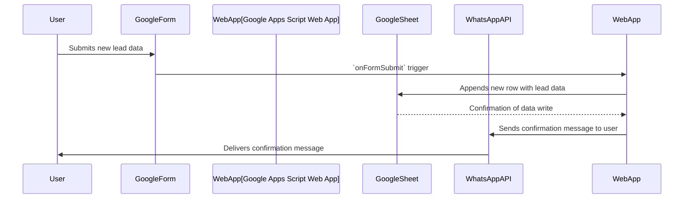
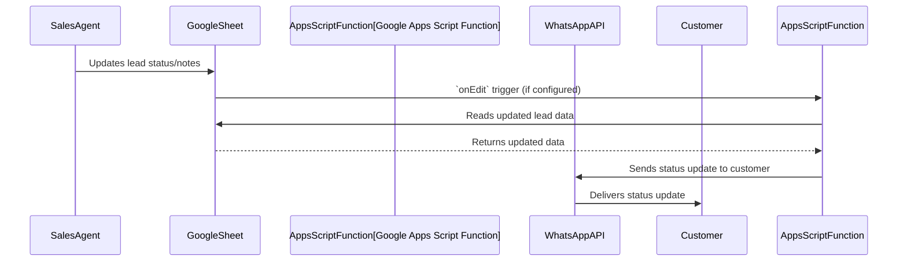

# Anwar Sales Ecosystem - Comprehensive Documentation

## 📋 Table of Contents

1. [Quick Start Guide](#quick-start-guide)
2. [System Overview](#system-overview)
3. [Architecture](#architecture)
4. [Core JavaScript Files](#core-javascript-files)
5. [Business Logic & Workflows](#business-logic--workflows)
6. [User Journeys](#user-journeys)
7. [User Stories](#user-stories)
8. [API Documentation](#api-documentation)
9. [Setup & Deployment](#setup--deployment)
10. [Development Workflow](#development-workflow)
11. [Testing](#testing)
11. [Testing Improvements](#testing-improvements)
12. [Troubleshooting](#troubleshooting)
12. [Documentation Files](#documentation-files)
13. [Configuration Files](#configuration-files)
14. [Operational Details](#operational-details)
15. [Security & Permissions](#security--permissions)
16. [Visual Documentation](#visual-documentation)
17. [Business Logic](#business-logic)
18. [Performance Considerations](#performance-considerations)
15. [Performance Considerations](#performance-considerations)
16. [Advanced Features](#advanced-features)

---

## 🚀 Quick Start Guide

This section provides a quick guide to get the Anwar Sales Ecosystem up and running. For detailed setup instructions, refer to the [Setup & Deployment](#setup--deployment) section.

### Prerequisites

Before you begin, ensure you have the following:

-   A Google Account with access to Google Apps Script, Google Sheets, and Google Forms.
-   Node.js and npm (or yarn) installed for local development and testing tools.

### Installation

1.  **Clone the Repository**:

    ```bash
    git clone https://github.com/your-repo/AnwarSalesEcosystem.git
    cd AnwarSalesEcosystem
    ```

2.  **Install Dependencies (if any local tools are used)**:

    ```bash
    npm install
    # or yarn install
    ```

### Basic Configuration

1.  **Google Apps Script Project**: Create a new Google Apps Script project and copy the contents of `Code.gs`, `appsscript.json`, and all `.js` files from the root directory into your Apps Script project.

2.  **Update `config.js`**: Modify the `config.js` file within your Apps Script project to include your specific Google Sheet IDs and any other relevant configurations.

    ```javascript
    // Example snippet from config.js
    const CONFIG = {
        SPREADSHEET_IDS: {
            main: 'YOUR_MAIN_SPREADSHEET_ID',
            // Add other spreadsheet IDs as needed
        },
        // ... other configurations
    };
    ```

3.  **Deploy as Web App (Optional, for external access)**:
    -   In the Google Apps Script editor, go to `Deploy > New deployment`.
    -   Select `Web app` as the type.
    -   Configure execution as `Me` and access as `Anyone` (or `Anyone with Google account` based on your security needs).
    -   Note down the Web App URL.

### Running the System

1.  **Initial Setup**: Run the `setupProject()` function from the Apps Script editor once to create all necessary Google Forms and link them to your Google Sheets.

2.  **Trigger Setup**: Ensure all time-driven and form-submit triggers are set up. You can use the `createTriggers()` function or manually configure them in the Apps Script editor under `Triggers`.

### Next Steps

-   Explore the [System Overview](#system-overview) for a deeper understanding of the architecture.
-   Refer to [Setup & Deployment](#setup--deployment) for detailed configuration and deployment steps.
-   Check the [Testing](#testing) section to run tests and ensure everything is working as expected.

---

---

## 🎯 System Overview

---

## ⚙️ Operational Details

---

## 🔒 Security & Permissions

---

## 📊 Visual Documentation

---

## 💡 Business Logic

This section details the core business logic and processes implemented within the Anwar Sales Ecosystem, focusing on how different modules interact to achieve sales and operational objectives.

### 1. Lead Management Workflow

-   **Lead Capture**: New leads are primarily captured via Google Forms. Each form submission triggers a Google Apps Script function (`onFormSubmit`) that processes the data.
-   **Data Storage**: Processed lead data is appended to a designated Google Sheet, serving as the central database for leads.
-   **Initial Contact/Notification**: Upon successful lead capture, an automated WhatsApp message is sent to the lead (if contact information is available) and/or internal sales agents, confirming receipt and initiating the sales process.
-   **Lead Assignment**: Leads can be manually or automatically assigned to sales agents based on predefined rules (e.g., geographical area, product interest) within the Google Sheet or via a dedicated script function.

### 2. Sales Process Automation

-   **Status Tracking**: Sales agents update lead statuses (e.g., "New", "Contacted", "Qualified", "Converted", "Lost") directly in the Google Sheet. Changes can trigger automated actions.
-   **Follow-up Reminders**: Scripts can be configured to send automated follow-up reminders to sales agents for leads that have been in a certain status for too long or require immediate action.
-   **Order Creation**: When a lead converts, an "order" can be generated. This might involve creating a new entry in an `Orders` sheet, updating inventory, or triggering further notifications.
-   **WhatsApp Communication**: The system facilitates two-way communication via WhatsApp for sales agents to interact with leads/customers, send product information, or confirm appointments.

### 3. Product and Inventory Management (Conceptual)

-   **Product Catalog**: A dedicated Google Sheet can store product information (SKU, name, price, description).
-   **Inventory Levels**: Inventory counts can be maintained in Google Sheets. Sales or order creation processes would ideally decrement inventory, and a separate process could handle stock replenishment.
-   **Pricing Rules**: Business logic for dynamic pricing, discounts, or promotions can be implemented within Apps Script functions that retrieve data from product sheets.

### 4. Reporting and Analytics (Conceptual)

-   **Sales Performance**: Scripts can aggregate data from lead and order sheets to generate reports on sales performance (e.g., conversion rates, sales by agent, revenue).
-   **Lead Source Analysis**: Analyze lead data to identify the most effective lead generation channels.
-   **Custom Dashboards**: Google Sheets' built-in charting and pivot table features, combined with Apps Script, can create custom dashboards for real-time insights.

### 5. Dispute Resolution Workflow

-   **Dispute Submission**: Customers or internal teams can submit disputes (e.g., order issues, service complaints) via a dedicated Google Form or direct entry into a `Disputes` Google Sheet.
-   **Categorization and Prioritization**: Disputes are categorized (e.g., "Billing", "Delivery", "Product Quality") and prioritized based on severity or impact.
-   **Resolution Tracking**: The system tracks the status of disputes (e.g., "Open", "In Progress", "Resolved", "Escalated") and assigns them to responsible personnel.
-   **Communication**: Automated notifications can be sent to relevant parties (customer, sales agent, support team) at different stages of the dispute resolution process.

### 6. Employee Management (Conceptual)

-   **Employee Database**: A Google Sheet can store employee information, roles, and access levels.
-   **Performance Tracking**: Sales performance metrics can be linked to individual employees for tracking and evaluation.

### 7. Integration Points

-   **Google Forms**: Primary input for leads and disputes.
-   **Google Sheets**: Core database and reporting tool.
-   **WhatsApp API**: Real-time communication with leads and customers.
-   **Google Apps Script**: Orchestrates all business logic, data manipulation, and integrations.

---

This section provides visual aids to understand the system's architecture and data flow.

### 1. System Architecture Diagram

```mermaid
graph TD
    A[Google Forms] --> B{Google Apps Script Web App}; 
    B --> C[Google Sheets Database];
    B --> D[WhatsApp API];
    D --> E[End User (WhatsApp)];
    C --> F[Google Apps Script Functions];
    F --> G[Google Forms];
    F --> H[Google Sheets];
    F --> I[WhatsApp API];
    I --> E;
    subgraph External Services
        D
    end
    subgraph Google Ecosystem
        A
        B
        C
        F
        G
        H
    end
```

### 2. Data Flow Diagram (Example: New Lead Submission)



### 3. Component Interaction Diagram (Example: Sales Update)



---

This section outlines the security considerations and permission requirements for the Anwar Sales Ecosystem.

### 1. Google Apps Script Permissions

-   **Script Authorization**: When first running the script, users will be prompted to authorize:
    -   Access to Google Sheets (read/write)
    -   Access to Google Forms (read/write)
    -   Access to Google Drive (if storing files)
    -   External API access (for WhatsApp integration)

-   **Scopes**: The following OAuth scopes are required:
    ```javascript
    // Required scopes in appsscript.json
    "oauthScopes": [
      "https://www.googleapis.com/auth/spreadsheets",
      "https://www.googleapis.com/auth/forms",
      "https://www.googleapis.com/auth/drive",
      "https://www.googleapis.com/auth/script.external_request"
    ]
    ```

### 2. Google Sheets Access Control

-   **Sheet Permissions**: Configure sharing settings for your Google Sheets:
    -   **Viewers**: Can view but not edit
    -   **Editors**: Can edit content (assign carefully)
    -   **Owners**: Full control (limited to trusted administrators)

-   **Protect Ranges**: Use sheet protection to prevent accidental edits to critical cells/ranges:
    ```javascript
    // Example: Protect a range
    const sheet = SpreadsheetApp.getActiveSpreadsheet().getSheetByName('Data');
    const range = sheet.getRange('A1:D10');
    const protection = range.protect().setDescription('Protected data range');
    protection.addEditor('admin@example.com'); // Only this email can edit
    ```

### 3. API Security

-   **WhatsApp API Keys**: Store API keys securely:
    -   Never commit API keys to version control
    -   Use Apps Script's Properties Service for storage:
        ```javascript
        // Store API key
        PropertiesService.getScriptProperties().setProperty('WHATSAPP_API_KEY', 'your-api-key');
        
        // Retrieve API key
        const apiKey = PropertiesService.getScriptProperties().getProperty('WHATSAPP_API_KEY');
        ```

-   **Web App Security**: If deploying as a web app:
    -   Set appropriate access ("Anyone", "Anyone within organization", or "Only myself")
    -   Consider adding additional authentication if exposing sensitive data

### 4. Data Privacy

-   **PII Handling**: Be cautious with Personally Identifiable Information (PII):
    -   Avoid storing unnecessary PII in sheets
    -   Implement data masking if displaying sensitive information

-   **Logging**: Ensure logs don't contain sensitive data

### 5. Audit Trail

-   **Version History**: Google Sheets and Apps Script maintain version history
-   **Execution Logs**: Apps Script dashboard records all script executions
-   **Form Submission Logs**: Google Forms tracks all submissions

---

This section provides insights into the operational aspects of the Anwar Sales Ecosystem, covering monitoring, alerting, and disaster recovery.

### 1. Monitoring

-   **Google Apps Script Dashboard**: The Google Apps Script project dashboard provides basic monitoring for script executions, including:
    -   **Executions**: View recent script runs, their status (completed, failed), and duration.
    -   **Errors**: Monitor errors and stack traces for debugging.
    -   **Triggers**: Check the status and last run time of installed triggers.

-   **Google Cloud Logging (Optional)**: For more advanced monitoring and centralized logging, integrate Google Apps Script with Google Cloud Logging.
    -   **Setup**: Enable the Cloud Logging API in your Google Cloud Project associated with your Apps Script project.
    -   **Usage**: Use `console.log()` in your Apps Script code, and these logs will appear in Cloud Logging, allowing for advanced filtering, metrics, and alerts.

-   **Google Sheets Activity**: Monitor changes and access patterns in your Google Sheets via the "Last edit was..." feature and version history.

### 2. Alerting

-   **Apps Script Error Notifications**: Configure error notifications in the Apps Script project settings to receive emails for unhandled exceptions.

-   **Custom Alerting (via Notifications.js)**:
    -   Implement custom alerting mechanisms using the `notifications.js` module.
    -   **Example**: Send WhatsApp or email alerts to administrators or on-call personnel when critical errors occur (e.g., `try-catch` blocks around key business logic).

    ```javascript
    function criticalFunction() {
      try {
        // ... critical business logic ...
      } catch (e) {
        const errorMessage = `Critical Error in criticalFunction: ${e.message} Stack: ${e.stack}`;
        sendWhatsAppMessage('admin_phone_number', errorMessage); // Send alert
        // Log to Cloud Logging if integrated
        console.error(errorMessage);
        throw e; // Re-throw to ensure Apps Script logs it
      }
    }
    ```

-   **Google Cloud Monitoring (Optional)**: If using Cloud Logging, set up custom metrics and alerting policies based on log patterns (e.g., count of "ERROR" logs exceeding a threshold).

### 3. Disaster Recovery and Backup

-   **Google Drive Version History**: Google Apps Script projects and Google Sheets automatically maintain version history, allowing you to revert to previous states.

-   **Regular Backups (Manual/Scripted)**:
    -   **Codebase**: Regularly download your Apps Script project as a `.json` or `.js` file using `clasp` or the Apps Script editor.
    -   **Data**: Periodically make copies of your critical Google Sheets or export them to other formats (e.g., CSV) as a backup measure.

-   **Redundancy**: While Google's infrastructure provides high availability, consider architectural patterns for critical components if extreme resilience is required (e.g., replicating data across multiple sheets/projects, though this adds complexity).

-   **Recovery Plan**: Document a clear recovery plan that outlines steps to restore service in case of data loss or system failure, including:
    -   Steps to restore Apps Script code.
    -   Steps to restore Google Sheet data.
    -   Procedures for re-establishing triggers and web app deployments.

### 4. Performance Considerations

-   **Batch Operations**: Minimize calls to Google services (e.g., `SpreadsheetApp.getRange().getValues()`) by reading/writing data in batches.
-   **Caching**: Utilize Apps Script's Cache Service for frequently accessed, non-sensitive data to reduce redundant computations.
-   **Trigger Optimization**: Ensure triggers are efficient and only run when necessary. Avoid heavy computations within `onEdit` or `onFormSubmit` functions; delegate to time-driven triggers if possible.
-   **Execution Quotas**: Be mindful of Google Apps Script daily execution quotas. Optimize code to stay within these limits.

---

---

## 📚 API Documentation

This section provides details on the various APIs and integration points within the Anwar Sales Ecosystem. While the system primarily uses Google Apps Script for backend logic, certain functionalities can be exposed or interact with external services.

### 1. Google Apps Script Web App API

If deployed as a Web App, the Apps Script project can expose a `doPost(e)` or `doGet(e)` function, acting as a simple API endpoint.

-   **Endpoint Example**:
    ```
    https://script.google.com/macros/s/YOUR_DEPLOYMENT_ID/exec
    ```
    (Replace `YOUR_DEPLOYMENT_ID` with the actual deployment ID obtained after deploying the script as a Web App.)

-   **Authentication**:
    -   Typically handled by Google's OAuth for authenticated users.
    -   For `Anyone` access, no explicit authentication is required, but you should implement your own security measures (e.g., API keys, token validation) within the `doPost`/`doGet` functions for sensitive operations.

-   **Request Example (POST)**:
    ```json
    {
        "action": "createEngineer",
        "data": {
            "name": "John Doe",
            "email": "john.doe@example.com",
            "phone": "+1234567890"
        }
    }
    ```

-   **Response Example (JSON)**:
    ```json
    {
        "status": "success",
        "message": "Engineer created successfully",
        "id": "ENG-001"
    }
    ```

### 2. Google Forms Integration

Google Forms serve as the primary data entry points, and their submissions can be considered an implicit API.

-   **Mechanism**: Form submissions trigger the `onFormSubmitTrigger(e)` function in `triggers.js`.
-   **Data Flow**: Form data is automatically parsed and routed to the relevant business logic (e.g., `handleEngineerFormSubmit` in `engineer.js`).

### 3. WhatsApp Integration

The system integrates with WhatsApp for notifications, typically via a third-party WhatsApp Gateway or API.

-   **Function**: `sendWhatsAppMessage(to, message)` in `notifications.js`.
-   **Configuration**: API keys and endpoint URLs for the WhatsApp Gateway are managed in `config.js`.
-   **Rate Limiting**: Adhere to the rate limits imposed by your chosen WhatsApp API provider to avoid service interruptions.

### 4. Google Sheets as a Backend

Google Sheets act as the database. Direct programmatic access can be considered an API for data manipulation.

-   **Functions**: `sheets.js` provides functions like `appendRow()`, `findRow()`, `updateRow()`.
-   **Access**: Requires Google Apps Script permissions or service account access if interacting from external applications.

### API Best Practices

-   **Error Handling**: Implement robust error handling and meaningful error responses.
-   **Input Validation**: Always validate incoming data to prevent malformed requests and security vulnerabilities.
-   **Security**: Protect sensitive endpoints with appropriate authentication and authorization mechanisms.
-   **Logging**: Log API requests and responses for debugging and auditing purposes.

---

The **Anwar Sales Ecosystem** is a comprehensive Google Apps Script-based CRM and workflow management system designed for construction material supply chain operations. It manages the entire customer journey from lead generation to order fulfillment, covering:

- **Customer Registration & Management** (Engineers, Retailers, Partners)
- **Site & Project Management** (Potential Sites, Site Prescriptions)
- **Order Processing & Fulfillment** (Orders, Disputes, Tracking)
- **Operational Workflows** (Visits, Updates, Approvals)
- **Business Operations** (Retailer Points, Demand Generation)
- **Automated Notifications** (WhatsApp integration)

### Key Business Benefits

- ✅ **Streamlined Operations**: Automated workflows reduce manual intervention
- ✅ **Real-time Notifications**: WhatsApp integration ensures instant communication
- ✅ **Territory-based Management**: Role-based assignment and routing
- ✅ **Comprehensive Tracking**: End-to-end visibility of all operations
- ✅ **Scalable Architecture**: Modular design supports growth
- ✅ **Enhanced Security**: Role-based access control and data validation

---

## 🏗️ Architecture

---

## 👨‍💻 Development Workflow

This section outlines the recommended development workflow for contributing to the Anwar Sales Ecosystem project.

### 1. Version Control (Git)

-   **Repository**: The project uses Git for version control, hosted on GitHub (or a similar platform).
-   **Branching Strategy**: We follow a simplified Git Flow or GitHub Flow:
    -   `main` (or `master`): Represents the stable, production-ready code.
    -   `develop`: Integration branch for new features and bug fixes.
    -   `feature/your-feature-name`: Branches for new features, branched off `develop`.
    -   `bugfix/issue-description`: Branches for bug fixes, branched off `develop`.

### 2. Local Development Setup

While Google Apps Script runs in the cloud, local development can be facilitated using tools like `clasp` (Google Apps Script CLI).

1.  **Install `clasp`**:

    ```bash
    npm install -g @google/clasp
    ```

2.  **Login to `clasp`**:

    ```bash
    clasp login
    ```

3.  **Clone the Apps Script Project (if starting fresh)**:

    ```bash
    clasp clone <SCRIPT_ID>
    ```

4.  **Push/Pull Code**:

    ```bash
    clasp pull   # Pull latest changes from Apps Script project
    clasp push   # Push local changes to Apps Script project
    ```

### 3. Contribution Guidelines

1.  **Fork the Repository**: Start by forking the main repository to your personal GitHub account.
2.  **Create a New Branch**: Always work on a new feature or bugfix branch, never directly on `develop` or `main`.
    ```bash
    git checkout develop
    git pull origin develop
    git checkout -b feature/my-new-feature
    ```
3.  **Code Changes**: Implement your changes, adhering to the coding standards (see below).
4.  **Test Your Changes**: Ensure all existing tests pass and add new tests for your changes (see [Testing](#testing)).
5.  **Commit Messages**: Write clear, concise commit messages. Use the [Conventional Commits](https://www.conventionalcommits.org/en/v1.0.0/) specification if possible (e.g., `feat: add new user registration module`, `fix: resolve order processing bug`).
6.  **Push to Your Fork**: Push your branch to your forked repository.
    ```bash
    git push origin feature/my-new-feature
    ```
7.  **Create a Pull Request (PR)**: Open a Pull Request from your feature branch to the `develop` branch of the main repository.
    -   Provide a descriptive title and detailed description of your changes.
    -   Reference any related issues.

### 4. Code Review Process

-   All Pull Requests must be reviewed by at least one other developer.
-   Reviewers will check for:
    -   Code quality and adherence to standards.
    -   Correctness and functionality.
    -   Test coverage.
    -   Documentation updates.
-   Address all review comments and make necessary changes.
-   Once approved, the PR will be merged into `develop`.

### 5. Deployment Process

-   Changes merged into `develop` are subject to further testing.
-   Periodically, `develop` will be merged into `main` for production deployments.
-   Production deployments are typically handled by administrators.

### 6. Coding Standards

-   **JavaScript**: Follow Google Apps Script best practices and general JavaScript style guides (e.g., Airbnb style guide).
-   **Naming Conventions**: Use `camelCase` for variables and functions, `PascalCase` for classes/constructors, and `UPPER_SNAKE_CASE` for constants.
-   **Comments**: Add clear and concise comments for complex logic, functions, and important sections.
-   **Modularity**: Keep functions and files focused on a single responsibility.

---

### System Architecture

```
┌─────────────────┐    ┌──────────────┐    ┌─────────────────┐
│   Google Forms  │───▶│ Apps Script  │───▶│ Google Sheets   │
│   (Data Entry)  │    │ (Processing) │    │ (Data Storage)  │
└─────────────────┘    └──────────────┘    └─────────────────┘
                              │
                              ▼
                    ┌──────────────────┐
                    │ WhatsApp Gateway │
                    │  (Notifications) │
                    └──────────────────┘
```

### Technology Stack

- **Backend**: Google Apps Script (JavaScript)
- **Data Storage**: Google Sheets
- **Forms**: Google Forms
- **Notifications**: WhatsApp API integration
- **Triggers**: Time-based and event-based automation

### Modular Design

The system follows a modular architecture with separate JavaScript files for each business domain:

```
AnwarSalesEcosystem/
├── config.js              # Configuration & Constants
├── triggers.js            # Event Handling & Routing
├── setup.js              # System Setup & Form Creation
├── sheets.js             # Data Layer & Sheet Operations
├── notifications.js      # WhatsApp & Communication
├── validation.js         # Data Validation & Business Rules
├── admin.js              # Administrative Functions
├── crm.js                # CRM Operations & Approvals
│
├── Core Business Modules:
├── engineer.js           # Engineer Registration & Management
├── retailer.js           # Retailer Operations
├── partner.js            # Partner & Contractor Management
├── potential-site.js     # Site Registration & Approval
├── order.js              # Order Processing & Disputes
├── visit.js              # Customer Visits & Updates
├── site-prescription.js  # Site Prescriptions & Recommendations
├── ihb.js                # IHB (Independent House Builder) Management
├── retailer-point.js     # Retailer Point Requests
├── demand-generation.js  # Demand Generation Requests
│
└── Testing Modules:
    ├── test-visit.js
    ├── test-triggers.js
    ├── test-order-dispute.js
    ├── test-retailer-point-asm.js
    └── test-demand-generation.js
```

---

## 📁 Core JavaScript Files

---

## 🧪 Testing Improvements

This section outlines potential improvements and best practices for testing within the Anwar Sales Ecosystem.

### 1. Unit Testing

-   **Current State**: The project includes several `test-*.js` files (e.g., <mcfile name="test-visit.js" path="e:\Anwar_sales_eco\Inidividual-script\AnwarSalesEcosystem\test-visit.js"></mcfile>, <mcfile name="test-triggers.js" path="e:\Anwar_sales_eco\Inidividual-script\AnwarSalesEcosystem\test-triggers.js"></mcfile>) which serve as basic functional tests.
-   **Improvements**:
    -   **Dedicated Testing Framework**: Integrate a lightweight JavaScript testing framework (e.g., [QUnit](https://qunitjs.com/), [Jasmine](https://jasmine.github.io/)) that can run within the Apps Script environment or be adapted for local execution.
    -   **Mocking/Stubbing**: Implement mocking or stubbing for external dependencies (e.g., Google Sheets, external APIs) to isolate unit tests and ensure faster, more reliable execution.
    -   **Test Coverage**: Aim for higher test coverage, especially for critical business logic functions.

### 2. Integration Testing

-   **Focus**: Verify the interaction between different modules and external services (Google Sheets, Google Forms, WhatsApp API).
-   **Strategy**:
    -   **End-to-End Scenarios**: Create tests that simulate full user journeys (e.g., form submission -> data processing -> notification sending).
    -   **Dedicated Test Environment**: Use a separate Google Sheet and Google Form for integration tests to avoid polluting production data.
    -   **Automated Triggers**: Ensure automated triggers (e.g., `onFormSubmit`, `onEdit`) are correctly invoked and handle data as expected.

### 3. Test Execution

-   **Local Execution**: For unit tests, consider setting up a local environment using `clasp` and a Node.js-based test runner to enable faster feedback loops during development.
-   **CI/CD Integration**: Explore options for integrating tests into a Continuous Integration pipeline (e.g., GitHub Actions) to automatically run tests on every push or pull request.

### 4. Code Coverage Reporting

-   **Tooling**: Investigate tools that can generate code coverage reports for JavaScript, even if it requires some adaptation for the Apps Script environment.
-   **Benefits**: Helps identify untested parts of the codebase and encourages comprehensive testing.

### 5. Browser Compatibility (for `index.html`)

-   If `index.html` or any other client-side components are used, ensure cross-browser compatibility testing.
-   **Tools**: Use browser developer tools or dedicated testing services (e.g., BrowserStack) to verify functionality across different browsers and devices.

### Example Test Structure (Conceptual)

```javascript
// In a test file, e.g., test-engineer.js

function testHandleEngineerFormSubmit() {
  // Mock event object for form submission
  const mockEvent = {
    namedValues: {
      'Engineer Name': ['Test Engineer'],
      'Email': ['test.engineer@example.com'],
      'NID Number': ['1234567890'],
      'Service Area': ['Dhaka'],
      'Contact Number': ['+8801XXXXXXXXX']
    }
  };

  // Mock Google Apps Script services (e.g., SpreadsheetApp, MailApp)
  // This requires a mocking library or manual stubbing
  // Example: jest.spyOn(SpreadsheetApp, 'getActiveSpreadsheet').mockReturnValue(...);

  try {
    handleEngineerFormSubmit(mockEvent);
    // Assertions: Check if data was correctly appended to sheet, notifications sent, etc.
    Logger.log('testHandleEngineerFormSubmit passed');
  } catch (e) {
    Logger.log('testHandleEngineerFormSubmit failed: ' + e.message);
    throw e; // Re-throw to indicate test failure
  }
}

function runAllTests() {
  Logger.log('Running all tests...');
  testHandleEngineerFormSubmit();
  // Call other test functions
  Logger.log('All tests completed.');
}
```

---

### 1. **config.js** - System Configuration

**Purpose**: Central configuration management for the entire system.

**Key Functions**:

- `CONFIG` - Main configuration object containing:
  - `SPREADSHEET_IDS`: All Google Sheets IDs for data storage
  - `FORMS`: Form configurations with fields and validation
  - `SHEET_NAMES`: Standardized sheet naming conventions
  - `SCHEMAS`: Data structures for each entity type
  - `TRIGGERS`: Event handler mapping

**Business Logic**:

- **Centralized Configuration**: Single source of truth for system settings
- **Form Definitions**: Standardized form structures across all modules
- **Data Schema Management**: Consistent data structure across sheets

**Use Cases**:

- System initialization and setup
- Form creation and validation
- Data structure consistency
- Multi-environment configuration management

---

### 2. **triggers.js** - Event Handling & Routing

**Purpose**: Central event routing system for form submissions and sheet edits.

**Key Functions**:

- `onFormSubmitTrigger(e)`: Routes form submissions to appropriate handlers
- `onEditTrigger(e)`: Handles sheet edit events for approvals
- `createTriggers()`: Sets up all system triggers with auto-cleanup
- `createAllTriggersMenu()`: Admin interface for trigger management

**Business Logic**:

- **Event Routing**: Automatically routes events to correct business modules
- **Trigger Management**: Prevents duplicate triggers, ensures clean setup
- **Error Handling**: Robust error handling with detailed logging

**User Journey Integration**:

- Form submissions trigger business workflows
- Sheet edits trigger approval processes
- Background processes handle notifications

---

### 3. **setup.js** - System Setup & Form Creation

**Purpose**: Complete system setup and form creation automation.

**Key Functions**:

- `setupProject()`: Complete system initialization
- `createFormWithConfig()`: Automated Google Form creation
- `createAllForms()`: Bulk form creation for all modules
- `setupRetailerPointRequestForm()`: Specific form setup functions
- `setupDemandGenerationRequestForm()`: Demand generation form setup

**Business Logic**:

- **Automated Setup**: Zero-configuration system deployment
- **Form Generation**: Dynamic form creation from configuration
- **Validation Integration**: Built-in validation and error checking

**Admin User Stories**:

- As an admin, I want to set up the entire system with one click
- As an admin, I want to create all forms automatically
- As an admin, I want to ensure all triggers are properly configured

---

### 4. **sheets.js** - Data Layer & Sheet Operations

**Purpose**: Secure and reliable data operations for Google Sheets.

**Key Functions**:

- `getOrCreateSheetSafe()`: Safe sheet creation with error handling
- `appendRow()`: Secure data insertion with validation
- `findRow()`: Data lookup and search operations
- `updateRow()`: Safe data updates with concurrency control

**Business Logic**:

- **Data Integrity**: Ensures data consistency and validation
- **Error Recovery**: Handles sheet access failures gracefully
- **Performance Optimization**: Efficient data operations

**Technical Features**:

- Atomic operations for data consistency
- Automatic sheet creation with proper schemas
- Comprehensive error handling and logging

---

### 5. **notifications.js** - Communication System

**Purpose**: WhatsApp and communication management across all modules.

**Key Functions**:

- `sendWhatsAppMessage()`: Core WhatsApp messaging functionality
- `findEmployeeByEmail()`: Employee lookup for notifications
- `findEmployeesByRole()`: Role-based employee filtering
- `formatNotificationMessage()`: Message templating and formatting

**Business Logic**:

- **Role-based Routing**: Messages sent to appropriate personnel
- **Template Management**: Consistent message formatting
- **Fallback Mechanisms**: Ensures critical notifications are delivered

**Communication Patterns**:

- **Instant Notifications**: Real-time updates for urgent matters
- **Approval Workflows**: Status change notifications
- **Error Alerts**: System issue notifications

---

## 🔄 Business Logic & Workflows

### 1. **Engineer Registration Workflow** (`engineer.js`)

**Process Flow**:

```
Engineer Submits Form → Data Validation → CRM Storage →
Admin Notification → Manual Approval → WhatsApp Confirmation
```

**Key Functions**:

- `handleEngineerFormSubmit(e)`: Main form submission handler
- `handleEngineerApprovalsEdit(e)`: Approval workflow management

**Business Rules**:

- Engineers must provide complete contact information
- NID documentation required for verification
- Territory-based assignment for management
- WhatsApp notifications for status updates

**User Stories**:

- **As an Engineer**, I want to register in the system to receive project notifications
- **As a BDO**, I want to approve engineer registrations to expand our network
- **As an Admin**, I want to track all registered engineers by territory

---

### 2. **Potential Site Management** (`potential-site.js`)

**Process Flow**:

```
Site Registration → Location Validation → BDO Review →
Approval/Rejection → Project Creation → Customer Notification
```

**Key Functions**:

- `handlePotentialSiteFormSubmit(e)`: Site registration processing
- `handlePotentialSiteApprovalsEdit(e)`: Approval workflow
- `createProjectFromApprovedSite()`: Automatic project creation
- `handlePotentialSiteUpdateFormSubmit(e)`: Site information updates

**Business Rules**:

- GPS coordinates required for location accuracy
- BDO approval required before project creation
- Automatic project ID generation (P.S-XXX format)
- Territory-based BDO assignment

**User Stories**:

- **As a Customer**, I want to register my construction site to get services
- **As a BDO**, I want to approve valid sites to expand our coverage area
- **As an Engineer**, I want to receive notifications about approved sites in my territory

---

### 3. **Order Processing System** (`order.js`)

**Process Flow**:

```
Order Submission → Site Validation → Territory Assignment →
Engineer/Partner Routing → Dispute Management → Fulfillment Tracking
```

**Key Functions**:

- `handleOrderFormSubmit(e)`: Main order processing
- `sendOrderNotifications()`: Multi-party notification system
- `sendDisputeNotifications()`: Dispute escalation management
- `createDisputeNotificationMessage()`: Dispute communication templates

**Business Rules**:

- Orders must reference approved potential sites
- Automatic engineer/partner assignment based on requirements
- Dispute notifications for unmet requirements (Engineer/Partner)
- BDO/CRO escalation for dispute resolution

**Advanced Features**:

- **Smart Routing**: Orders automatically assigned to appropriate personnel
- **Dispute Management**: Automatic escalation when requirements not met
- **Status Tracking**: Real-time order status updates

**User Stories**:

- **As a Customer**, I want to place orders for construction materials easily
- **As an Engineer**, I want to receive order notifications for my assigned sites
- **As a BDO**, I want to handle disputes when engineers are not available

---

### 4. **Visit Management System** (`visit.js`)

**Process Flow**:

```
Visit Scheduling → Customer Notification → Visit Execution →
Status Updates → Follow-up Actions → Progress Tracking
```

**Key Functions**:

- `handleVisitFormSubmit(e)`: Visit scheduling and processing
- `sendVisitNotification()`: Customer and team notifications
- `handleVisitUpdateFormSubmit(e)`: Visit status and progress updates
- `sendVisitUpdateNotification()`: Status change communications

**Business Rules**:

- GPS coordinates captured for visit verification
- Photo documentation required for visit proof
- Automatic follow-up scheduling based on visit outcomes
- Customer satisfaction tracking

**Visit Types**:

- **Initial Site Survey**: First customer contact and site assessment
- **Follow-up Visits**: Progress monitoring and relationship building
- **Technical Consultation**: Engineering and technical support
- **Problem Resolution**: Issue investigation and solutions

---

### 5. **Retailer Point System** (`retailer-point.js`)

**Process Flow**:

```
BDO/CRO Request → ASM Notification → Territory Validation →
Approval/Rejection → Point Assignment → Performance Tracking
```

**Key Functions**:

- `handleRetailerPointFormSubmit(e)`: Point request processing
- `sendRetailerPointNotifications()`: ASM notification system
- `sendFallbackASMNotification()`: Fallback notification for unassigned territories
- `handleRetailerPointRequestsEdit(e)`: Approval workflow management

**Business Rules**:

- Only BDO/CRO can request retailer points
- ASM approval required for point assignment
- Territory-based ASM routing with fallback mechanisms
- Performance tracking and reporting

**User Stories**:

- **As a BDO**, I want to request retailer points to expand our retail network
- **As an ASM**, I want to approve retailer point requests in my territory
- **As a CRO**, I want to track retailer point performance across regions

---

### 6. **Demand Generation System** (`demand-generation.js`)

**Process Flow**:

```
ASM Submission → BD Incharge Notification → Market Analysis →
Approval/Rejection → Implementation Guidance → Progress Monitoring
```

**Key Functions**:

- `handleDemandGenerationFormSubmit(e)`: Request processing
- `sendDemandGenerationNotifications()`: BD Incharge notification
- `findBDInchargeByTerritoryAndBusinessUnit()`: Smart routing logic
- `approveDemandGenerationRequest()`: Approval workflow

**Business Rules**:

- ASM-only submission rights
- Territory and business unit-based BD Incharge assignment
- Market viability assessment required
- Implementation tracking and monitoring

**Strategic Features**:

- **Market Intelligence**: Territory-based demand analysis
- **Resource Planning**: Strategic resource allocation
- **Performance Metrics**: Demand generation effectiveness tracking

---

## 👥 User Journeys

### 1. **Customer Journey: From Inquiry to Order Fulfillment**

**Stage 1: Discovery & Registration**

```
Customer Contact → Site Registration → Location Verification →
BDO Approval → Project Creation → Welcome Communication
```

**Touchpoints**:

- Initial contact through referral or marketing
- Site registration via Google Form
- GPS location capture for accuracy
- BDO verification and approval
- Automatic project ID generation
- WhatsApp welcome message with project details

**Stage 2: Service Engagement**

```
Visit Scheduling → Site Survey → Prescription Generation →
Technical Consultation → Order Placement → Fulfillment
```

**Touchpoints**:

- Engineer visit scheduling
- On-site technical assessment
- Material prescription and recommendations
- Order submission through dedicated forms
- Engineer/partner assignment
- Order tracking and updates

**Stage 3: Ongoing Relationship**

```
Follow-up Visits → Additional Orders → Feedback Collection →
Referral Generation → Long-term Partnership
```

---

### 2. **Engineer Journey: Registration to Service Delivery**

**Stage 1: Registration & Onboarding**

```
Registration Application → Document Verification → Territory Assignment →
Approval → System Access → Training & Orientation
```

**Stage 2: Daily Operations**

```
Order Notifications → Visit Scheduling → Site Assessment →
Service Delivery → Status Reporting → Customer Follow-up
```

**Stage 3: Performance & Growth**

```
Performance Tracking → Feedback Integration → Territory Expansion →
Leadership Opportunities → Partner Development
```

---

### 3. **BDO Journey: Territory Management**

**Stage 1: Site Development**

```
Lead Generation → Site Evaluation → Approval Decisions →
Territory Expansion → Team Coordination
```

**Stage 2: Operations Management**

```
Engineer Coordination → Order Oversight → Dispute Resolution →
Performance Monitoring → Strategic Planning
```

**Stage 3: Business Growth**

```
Retailer Network Development → Demand Generation →
Market Analysis → Team Development → Goal Achievement
```

---

## 📖 User Stories

### **Engineer User Stories**

**Registration & Setup**

- As an **Engineer**, I want to register in the system easily so that I can receive project assignments
- As an **Engineer**, I want to upload my NID documents securely for verification
- As an **Engineer**, I want to specify my service areas so I receive relevant assignments

**Daily Operations**

- As an **Engineer**, I want to receive WhatsApp notifications for new orders in my territory
- As an **Engineer**, I want to update my availability status to manage my workload
- As an **Engineer**, I want to submit visit reports with photos for documentation

**Customer Service**

- As an **Engineer**, I want to access customer site information before visits
- As an **Engineer**, I want to create site prescriptions with material recommendations
- As an **Engineer**, I want to escalate complex technical issues to specialists

### **Customer User Stories**

**Site Registration**

- As a **Customer**, I want to register my construction site easily through a simple form
- As a **Customer**, I want to receive confirmation when my site is approved
- As a **Customer**, I want to track the status of my site registration

**Service Requests**

- As a **Customer**, I want to request engineer visits for site consultation
- As a **Customer**, I want to receive advance notice of scheduled visits
- As a **Customer**, I want to place orders for construction materials easily

**Order Management**

- As a **Customer**, I want to track my order status in real-time
- As a **Customer**, I want to receive notifications about order updates
- As a **Customer**, I want to report issues or request changes to my orders

### **BDO (Business Development Officer) User Stories**

**Territory Management**

- As a **BDO**, I want to review and approve potential site registrations in my territory
- As a **BDO**, I want to assign engineers to customer sites based on availability and expertise
- As a **BDO**, I want to monitor territory performance and growth metrics

**Team Coordination**

- As a **BDO**, I want to manage engineer assignments and workload distribution
- As a **BDO**, I want to handle order disputes when engineers are unavailable
- As a **BDO**, I want to request retailer points to expand our network

**Performance Monitoring**

- As a **BDO**, I want to track customer satisfaction and service quality
- As a **BDO**, I want to generate reports on territory performance
- As a **BDO**, I want to identify opportunities for business growth

### **ASM (Area Sales Manager) User Stories**

**Retailer Network Management**

- As an **ASM**, I want to approve retailer point requests from BDOs and CROs
- As an **ASM**, I want to monitor retailer performance in my area
- As an **ASM**, I want to coordinate with multiple BDOs for territory coverage

**Demand Generation**

- As an **ASM**, I want to submit demand generation requests for new markets
- As an **ASM**, I want to receive feedback on my demand generation proposals
- As an **ASM**, I want to track the success of implemented demand generation strategies

### **BD Incharge User Stories**

**Strategic Planning**

- As a **BD Incharge**, I want to review demand generation requests from ASMs
- As a **BD Incharge**, I want to assess market viability and resource requirements
- As a **BD Incharge**, I want to approve or reject requests with detailed feedback

**Business Development**

- As a **BD Incharge**, I want to guide ASMs on effective demand generation strategies
- As a **BD Incharge**, I want to coordinate with other BD Incharge for regional planning
- As a **BD Incharge**, I want to monitor the success of approved demand generation initiatives

### **Admin User Stories**

**System Management**

- As an **Admin**, I want to set up the entire system with minimal configuration
- As an **Admin**, I want to create all necessary forms and triggers automatically
- As an **Admin**, I want to monitor system health and performance

**User Management**

- As an **Admin**, I want to manage user roles and permissions
- As an **Admin**, I want to track system usage and identify bottlenecks
- As an **Admin**, I want to backup and restore system data safely

**Maintenance & Support**

- As an **Admin**, I want to update system configurations without downtime
- As an **Admin**, I want to troubleshoot issues and provide user support
- As an **Admin**, I want to ensure data security and privacy compliance

---

## 🔧 API Reference

### **Core Configuration Functions**

#### `CONFIG`

**Type**: Object
**Description**: Central configuration object containing all system settings.

```javascript
CONFIG = {
  SPREADSHEET_IDS: { /* All Google Sheets IDs */ },
  FORMS: { /* Form configurations */ },
  SHEET_NAMES: { /* Sheet naming conventions */ },
  SCHEMAS: { /* Data structures */ },
  TRIGGERS: { /* Event handlers */ }
}
```

### **Trigger Management Functions**

#### `onFormSubmitTrigger(e)`

**Parameters**:

- `e` (Object): Google Apps Script form submission event object

**Returns**: void
**Description**: Central router for all form submissions. Automatically routes to appropriate business module handlers.

**Example**:

```javascript
// Automatically called by Google Apps Script
// Routes to handleOrderFormSubmit(), handleVisitFormSubmit(), etc.
```

#### `createTriggers()`

**Returns**: void
**Description**: Creates all system triggers with automatic cleanup of existing triggers.

**Features**:

- Deletes all existing triggers first
- Creates fresh triggers for all configured forms
- Skips unconfigured forms with warnings
- Comprehensive error handling and logging

### **Data Layer Functions**

#### `getOrCreateSheetSafe(spreadsheetId, sheetName, schema)`

**Parameters**:

- `spreadsheetId` (string): Google Sheets ID
- `sheetName` (string): Name of the sheet
- `schema` (Array): Column schema for sheet creation

**Returns**: Sheet object
**Description**: Safely creates or retrieves a sheet with proper error handling.

#### `appendRow(sheet, data)`

**Parameters**:

- `sheet` (Sheet): Target sheet object
- `data` (Array): Data array to append

**Returns**: Range object
**Description**: Safely appends data to sheet with validation.

### **Notification Functions**

#### `sendWhatsAppMessage(phoneNumber, message)`

**Parameters**:

- `phoneNumber` (string): Recipient's WhatsApp number
- `message` (string): Message content

**Returns**: boolean
**Description**: Sends WhatsApp message with error handling and retry logic.

#### `findEmployeeByEmail(email)`

**Parameters**:

- `email` (string): Employee email address

**Returns**: Object|null
**Description**: Finds employee record by email with role and territory information.

### **Business Module Functions**

#### Order Processing

##### `handleOrderFormSubmit(e)`

**Parameters**:

- `e` (Object): Form submission event

**Returns**: void
**Description**: Processes customer orders with automatic routing and notifications.

**Workflow**:

1. Validates potential site ID
2. Generates unique order ID
3. Assigns engineer/partner based on requirements
4. Sends notifications to all parties
5. Creates dispute notifications if requirements not met

##### `sendDisputeNotifications(orderData, potentialSiteInfo, submitterEmployee)`

**Parameters**:

- `orderData` (Object): Order information
- `potentialSiteInfo` (Object): Site details
- `submitterEmployee` (Object): Customer information

**Returns**: void
**Description**: Handles dispute notifications when engineer/partner requirements are not met.

#### Visit Management

##### `handleVisitFormSubmit(e)`

**Parameters**:

- `e` (Object): Form submission event

**Returns**: void
**Description**: Processes visit scheduling with customer notifications.

##### `sendVisitNotification(visitData)`

**Parameters**:

- `visitData` (Object): Visit details and scheduling information

**Returns**: void
**Description**: Sends visit confirmations to customers and team members.

### **Setup Functions**

#### `setupProject()`

**Returns**: void
**Description**: Complete system initialization including sheets, forms, and triggers.

#### `createFormWithConfig(formKey, formConfig, folder)`

**Parameters**:

- `formKey` (string): Configuration key for the form
- `formConfig` (Object): Form configuration object
- `folder` (Folder): Google Drive folder for form storage

**Returns**: Object with form and spreadsheet references
**Description**: Creates Google Form based on configuration with automatic spreadsheet linking.

---

## 🚀 Setup & Deployment

### **Prerequisites**

- Google Account with Google Apps Script access
- Google Drive storage for forms and sheets
- WhatsApp Business API access (for notifications)

### **Quick Setup**

1. **Create New Apps Script Project**

   ```javascript
   // In Google Apps Script Editor
   // Copy all .js files to the project
   ```

2. **Run Initial Setup**

   ```javascript
   setupProject(); // Creates all required sheets and configurations
   ```

3. **Create Forms**

   ```javascript
   createAllForms(); // Generates all Google Forms
   ```

4. **Setup Triggers**

   ```javascript
   createAllTriggersMenu(); // Creates all event triggers
   ```

### **Configuration Steps**

1. **Update Spreadsheet IDs in config.js**

   ```javascript
   CONFIG.SPREADSHEET_IDS = {
     CRM: 'your-crm-spreadsheet-id',
     // Update other IDs as forms are created
   };
   ```

2. **Configure WhatsApp Integration**

   ```javascript
   // Update notification.js with your WhatsApp API credentials
   ```

3. **Test System**

   ```javascript
   runAllTests(); // Comprehensive system testing
   ```

### **Production Deployment**

1. **Environment Configuration**
   - Set up production Google Sheets
   - Configure WhatsApp API endpoints
   - Update configuration constants

2. **Security Setup**
   - Configure access permissions
   - Set up data backup procedures
   - Implement error monitoring

3. **Performance Optimization**
   - Enable trigger batching
   - Configure caching where appropriate
   - Set up monitoring dashboards

---

## 🧪 Testing

### **Test Coverage**

The system includes comprehensive test suites for all major components:

#### **Core System Tests**

- `test-triggers.js`: Trigger creation and management
- `test-visit.js`: Visit workflow and notifications
- `test-order-dispute.js`: Order processing and dispute handling
- `test-retailer-point-asm.js`: Retailer point management
- `test-demand-generation.js`: Demand generation workflow

#### **Test Execution**

**Run All Tests**:

```javascript
runAllTests(); // Comprehensive system testing
```

**Individual Module Tests**:

```javascript
runAllVisitTests();           // Visit system
runAllTriggerTests();         // Trigger management
runAllDemandGenerationTests(); // Demand generation
```

**Quick Verification**:

```javascript
quickTriggerTest();           // Rapid trigger verification
quickVisitTest();             // Basic visit functionality
```

### **Test Categories**

#### **Unit Tests**

- Individual function testing
- Data validation testing
- Error handling verification

#### **Integration Tests**

- End-to-end workflow testing
- Cross-module communication
- External API integration

#### **Performance Tests**

- Load testing for high-volume operations
- Trigger performance verification
- Notification delivery testing

---

## 🔧 Troubleshooting

### **Common Issues & Solutions**

#### **Trigger Issues**

**Problem**: Duplicate triggers causing multiple executions
**Solution**: Run `createAllTriggersMenu()` to clean up and recreate all triggers

**Problem**: Triggers not firing for form submissions
**Solution**: Verify spreadsheet IDs in config.js match actual form response sheets

#### **Notification Issues**

**Problem**: WhatsApp messages not being sent
**Solution**:

1. Check WhatsApp API credentials
2. Verify phone number formats
3. Check employee data for valid WhatsApp numbers

#### **Data Issues**

**Problem**: Sheet not found errors
**Solution**: Run `initializeCRMSpreadsheet()` to create missing sheets

**Problem**: Data validation failures
**Solution**:

1. Check schema definitions in config.js
2. Verify data types match expected formats
3. Review validation functions in validation.js

#### **Performance Issues**

**Problem**: Slow form processing
**Solution**:

1. Optimize sheet operations to reduce API calls
2. Implement batching for bulk operations
3. Add caching for frequently accessed data

### **Debug Tools**

#### **Logging & Monitoring**

```javascript
// Enable detailed logging
console.log('Debug info:', debugData);
Logger.log('Persistent log entry');
```

#### **Test Functions**

```javascript
// Quick system health check
quickSystemTest();

// Detailed component testing
runSpecificModuleTest('order');
```

#### **Manual Verification**

```javascript
// Check trigger status
viewCurrentTriggers();

// Verify sheet structures
validateAllSheets();

// Test notification delivery
testNotificationSystem();
```

### **Support Resources**

#### **Documentation**

- System architecture diagrams
- API documentation
- User guides and tutorials

#### **Monitoring**

- Error tracking and alerts
- Performance metrics
- Usage analytics

#### **Maintenance**

- Regular backup procedures
- System health checks
- Update and upgrade procedures

---

## 🎯 Conclusion

The **Anwar Sales Ecosystem** represents a comprehensive, scalable solution for construction material supply chain management. Its modular architecture, robust error handling, and automated workflows make it an ideal platform for businesses looking to streamline their operations and improve customer satisfaction.

### **Key Strengths**

- ✅ **Comprehensive Coverage**: Handles entire customer lifecycle
- ✅ **Automated Workflows**: Reduces manual intervention and errors
- ✅ **Real-time Communication**: WhatsApp integration for instant updates
- ✅ **Scalable Architecture**: Modular design supports business growth
- ✅ **Robust Testing**: Comprehensive test coverage ensures reliability

### **Future Enhancements**

- 📱 Mobile app integration
- 📊 Advanced analytics and reporting
- 🤖 AI-powered recommendations
- 🌐 Multi-language support
- 📈 Performance optimization

---

*This documentation covers the complete Anwar Sales Ecosystem. For specific implementation details or support, refer to the individual module documentation or contact the development team.*
